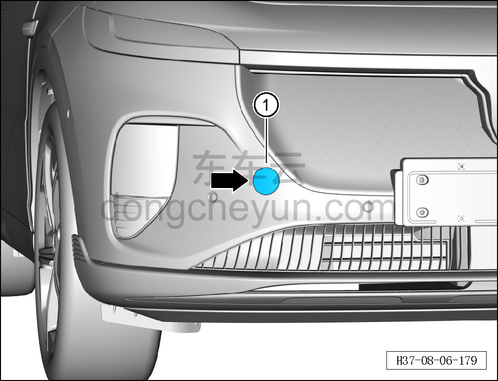

# Снятие и установка заглушки переднего буксировочного крюка

> Внутренняя и внешняя отделка › Наружные элементы отделки › Система наружных декоративных элементов  
> Оригинал: `拆卸与安装前拖钩堵盖` · [dongcheyun 56746](https://dongcheyun.com/p/56746), страница `03328ab47c8049a3a1433ee62393c30d` · [оглавление](../README.md)

**Порядок снятия**

1. Снимите заглушку переднего буксировочного крюка.

a. Нажмите на левую сторону заглушки переднего буксировочного крюка, извлеките заглушку переднего буксировочного крюка ①.

**Порядок установки**

Установка выполняется в обратном порядке.

**Внимание:**

**- Проверьте заглушку переднего буксировочного крюка на повреждения, при необходимости замените.**
