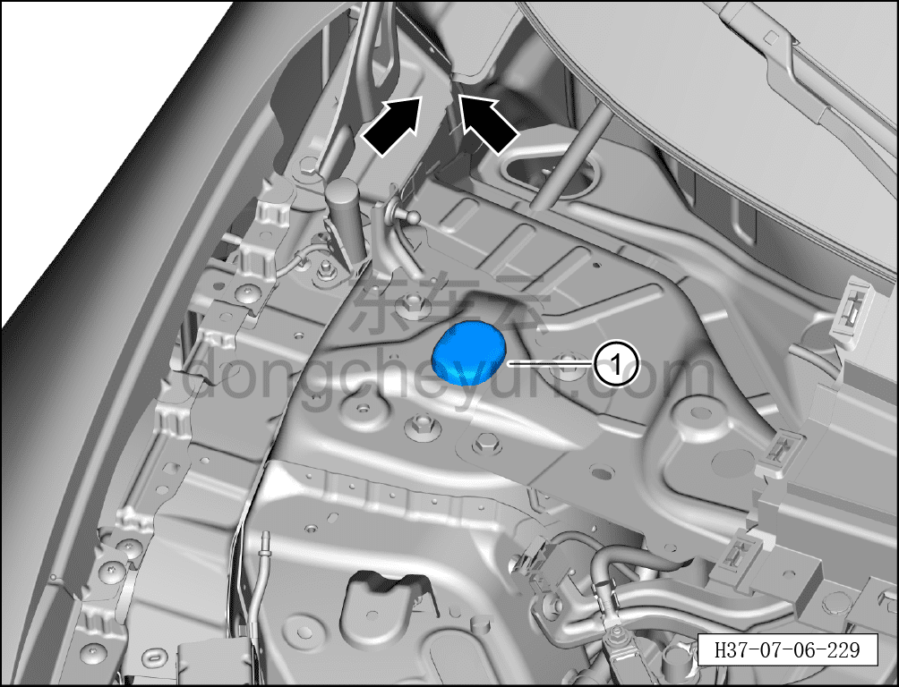

# Снятие и установка дождевого щитка амортизатора

> Внутренняя и внешняя отделка › Наружные элементы отделки › Система наружных декоративных элементов  
> Оригинал: `拆卸与安装减振器挡雨盖` · [dongcheyun 56746](https://dongcheyun.com/p/56746), страница `ad013b5ab9df4dd8be58f7dea5cbb100` · [оглавление](../README.md)

**Порядок снятия**

**Примечание:**

**- Далее описаны снятие и установка правого дождевого щитка амортизатора, для левой стороны действия аналогичны правой (по левому дождевому щитку амортизатора см. [8.6.7.7 Снятие и установка левой нижней декоративной накладки ветрового стекла](244-снятие-и-установка-крышки-стеклоочистителя-в-сборе.md)).**

1. Снимите крышку стеклоочистителя в сборе (правую). См. [8.6.7.6 Снятие и установка крышки стеклоочистителя в сборе (правой)](243-снятие-и-установка-крышки-стеклоочистителя-в-сборе.md)

2. Снимите левый дождевой щиток амортизатора.

a. С помощью съёмника обивки отогните левый дождевой щиток амортизатора ①.

**Порядок установки**

**Установка выполняется в обратном порядке.**
