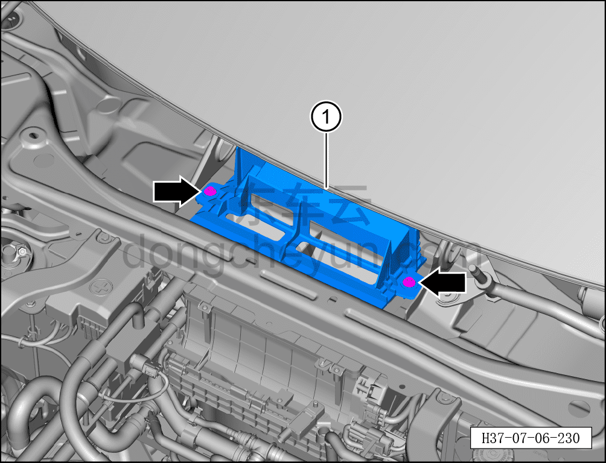

# Снятие и установка дождевого козырька воздухозаборника кондиционера

> Внутренняя и внешняя отделка › Наружные элементы отделки › Система наружных декоративных элементов  
> Оригинал: `拆卸与安装空调进风口挡雨罩` · [dongcheyun 56746](https://dongcheyun.com/p/56746), страница `3e9d28c8fba344259914fa67af0c8649` · [оглавление](../README.md)

**Порядок снятия**

1. Снимите крышку стеклоочистителя в сборе (левую). См. [8.6.7.7 Снятие и установка крышки стеклоочистителя в сборе (левой)](244-снятие-и-установка-крышки-стеклоочистителя-в-сборе.md)

2. Снимите дождевой козырёк воздухозаборника кондиционера.

a. С помощью торцевой головки на 10 мм выверните 2 крепёжных болта дождевого козырька воздухозаборника кондиционера.

Момент затяжки болта: 2,5±0,5 Н·м

b. Извлеките дождевой козырёк воздухозаборника кондиционера ①.

**Порядок установки**

**Установка выполняется в обратном порядке.**
