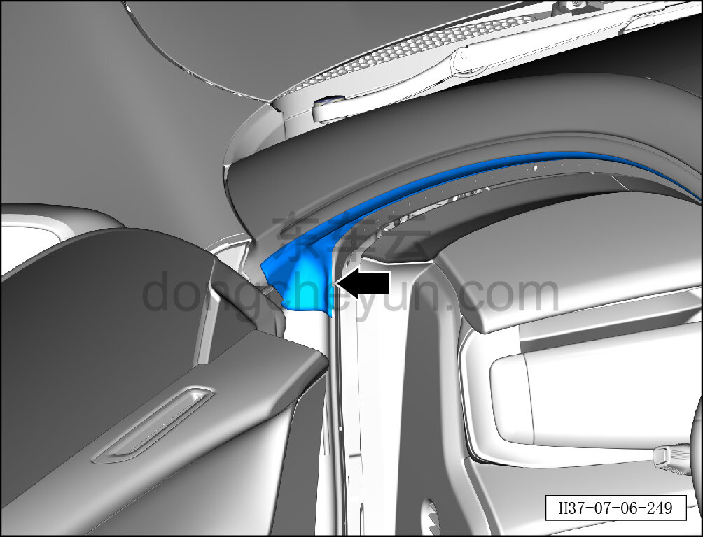
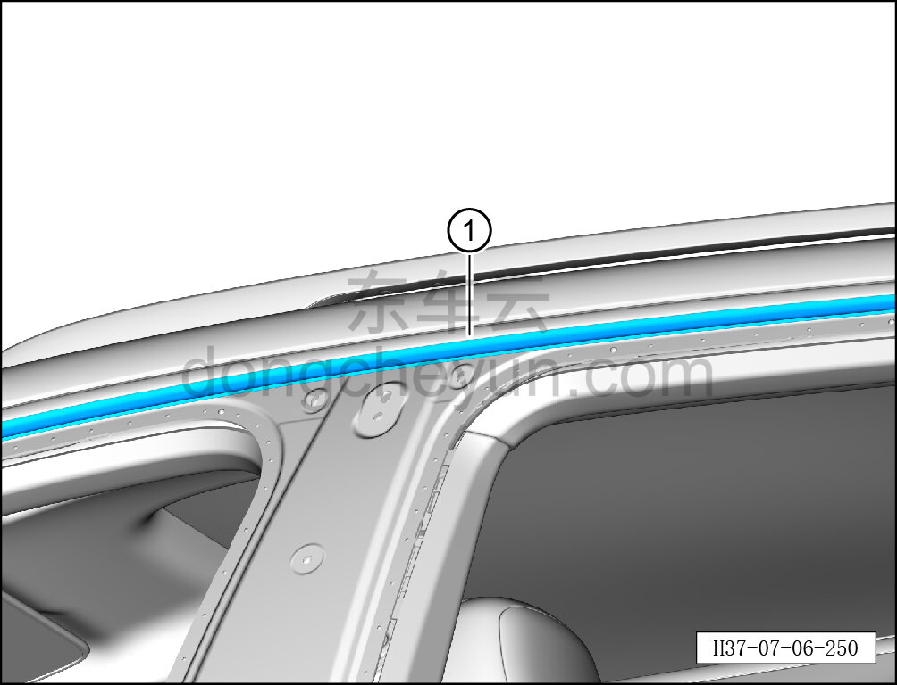

# Снятие и установка левого верхнего уплотнителя боковины в сборе

> Внутренняя и внешняя отделка › Наружные элементы отделки › Система наружных декоративных элементов  
> Оригинал: `拆卸与安装左侧围上部密封条总成` · [dongcheyun 56746](https://dongcheyun.com/p/56746), страница `eff46f90019a4425992ce8c3a4b9a60d` · [оглавление](../README.md)

**Порядок снятия**

**Примечание:**

**- Далее описаны снятие и установка левой верхней декоративной накладки боковины, для правой стороны действия аналогичны левой.**

1. Снимите уплотнитель проёма левой передней двери. См. [7.2.4.6 Снятие и установка уплотнителя проёма левой передней двери](../07-открывающиеся-элементы-кузова/019-снятие-и-установка-уплотнителя-проёма-левой-передней.md)

2. Снимите уплотнитель проёма левой задней двери. См. [7.3.4.6 Снятие и установка уплотнителя проёма левой задней двери](../07-открывающиеся-элементы-кузова/041-снятие-и-установка-уплотнителя-проёма-левой-задней.md)

3. Снимите наружную декоративную накладку стойки B левой боковины. См. [8.6.2.2 Снятие и установка наружной декоративной накладки стойки B левой боковины](159-снятие-и-установка-наружной-накладки-стойки-b-левой.md)

4. Снимите левый верхний уплотнитель боковины в сборе.

a. С помощью съёмника обивки отогните левый верхний уплотнитель боковины в сборе в месте, указанном стрелкой.

b. Отсоедините левый верхний уплотнитель боковины в сборе ①, двигаясь от переднего края к заднему.

**Порядок установки**

Установка выполняется в обратном порядке.

**Внимание:**

**- После завершения установки проверьте, что стык левого верхнего уплотнителя боковины в сборе с кузовом ровный, без выступов; при необходимости восстановите плоскостность резиновым молотком.**
