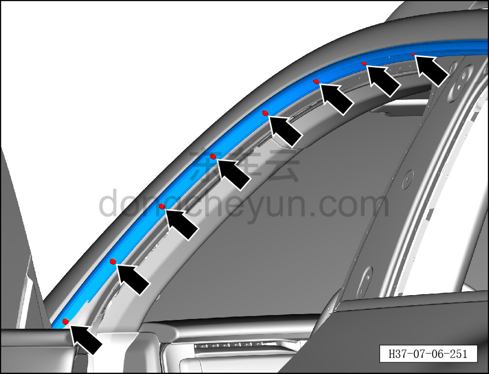
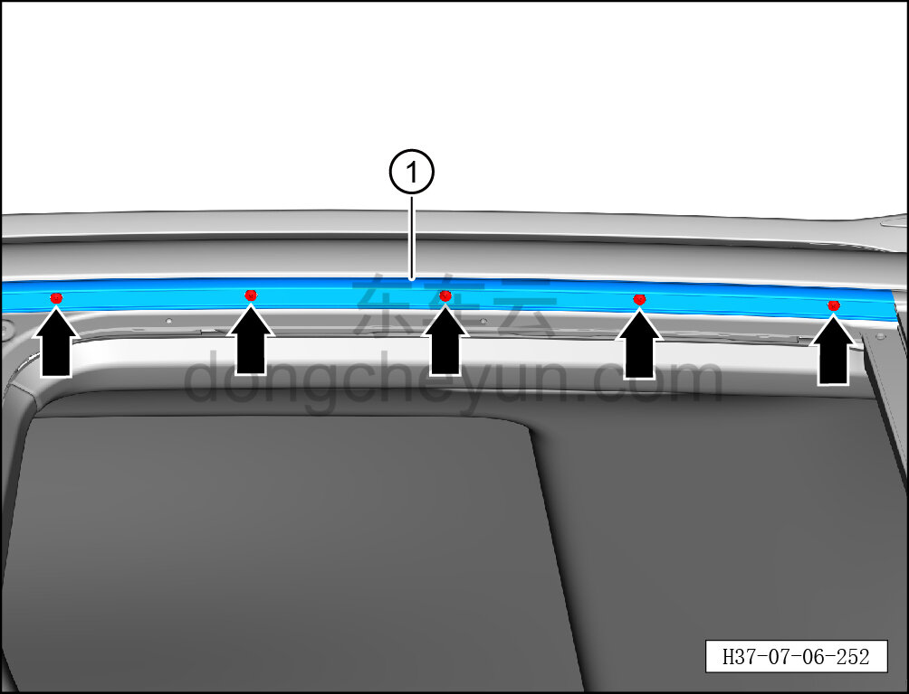

# Снятие и установка левой верхней декоративной накладки боковины

> Внутренняя и внешняя отделка › Наружные элементы отделки › Система наружных декоративных элементов  
> Оригинал: `拆卸与安装左侧围上部装饰条` · [dongcheyun 56746](https://dongcheyun.com/p/56746), страница `144969dc659a4505aa0fd40e91a19faa` · [оглавление](../README.md)

**Порядок снятия**

**Примечание:**

**- Далее описаны снятие и установка левой верхней декоративной накладки боковины, для правой стороны действия аналогичны левой.**

1. Снимите уплотнитель проёма левой передней двери. См. [7.2.4.6 Снятие и установка уплотнителя проёма левой передней двери](../07-открывающиеся-элементы-кузова/019-снятие-и-установка-уплотнителя-проёма-левой-передней.md)

2. Снимите уплотнитель проёма левой задней двери. См. [7.3.4.6 Снятие и установка уплотнителя проёма левой задней двери](../07-открывающиеся-элементы-кузова/041-снятие-и-установка-уплотнителя-проёма-левой-задней.md)

3. Снимите наружную декоративную накладку стойки B левой боковины. См. [8.6.2.2 Снятие и установка наружной декоративной накладки стойки B левой боковины](159-снятие-и-установка-наружной-накладки-стойки-b-левой.md)

4. Снимите левый верхний уплотнитель боковины в сборе. См. [8.6.6.22 Снятие и установка левого верхнего уплотнителя боковины в сборе](235-снятие-и-установка-левого-верхнего-уплотнителя.md)

5. Снимите левый верхний уплотнитель боковины в сборе.

a. С помощью крестовой отвёртки выверните 8 крепёжных винтов левого верхнего уплотнителя боковины в сборе.

Момент затяжки винта: 1.5±0.5 Н·м

b. С помощью крестовой отвёртки выверните 5 крепёжных винтов левого верхнего уплотнителя боковины в сборе.

Момент затяжки винта: 1.5±0.5 Н·м

c. Снимите левый верхний уплотнитель боковины в сборе ①.

**Порядок установки**

Установка выполняется в обратном порядке.

**Внимание:**

**- После завершения установки проверьте надёжность крепления левой верхней декоративной накладки боковины.**
