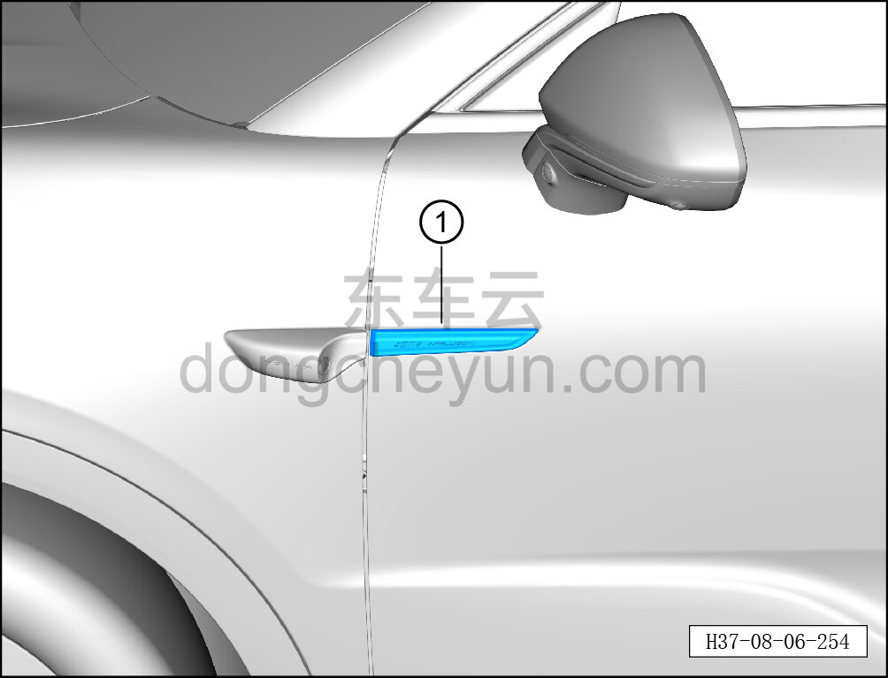

# Снятие и установка верхней декоративной накладки левой передней двери

> Внутренняя и внешняя отделка › Наружные элементы отделки › Система наружных декоративных элементов  
> Оригинал: `拆卸与安装左前车门上装饰条` · [dongcheyun 56746](https://dongcheyun.com/p/56746), страница `44241ed91e6949889e4105dece70f624` · [оглавление](../README.md)

**Порядок снятия**

**Примечание:**

**- Далее описаны снятие и установка верхней декоративной накладки левой передней двери, для правой стороны действия аналогичны левой.**

1. Снимите верхнюю декоративную накладку левой передней двери.

a. С помощью съёмника обивки отогните верхнюю декоративную накладку левой передней двери ①.

**Внимание:**

**- После снятия верхней декоративной накладки левой передней двери удалите остатки клея с автомобиля и протрите склеиваемую поверхность спиртом, чтобы на ней не было заметной пыли.**

**Порядок установки**

Установка выполняется в обратном порядке.

**Внимание:**

**- При установке обеспечьте, чтобы верхняя декоративная накладка передней двери была на одном уровне с передней накладкой и с кромкой кузовной панели передней двери.**

**- После завершения установки прижмите накладку роликом по всему периметру или прижмите рукой в течение 5 с, чтобы обеспечить надёжное склеивание.**
