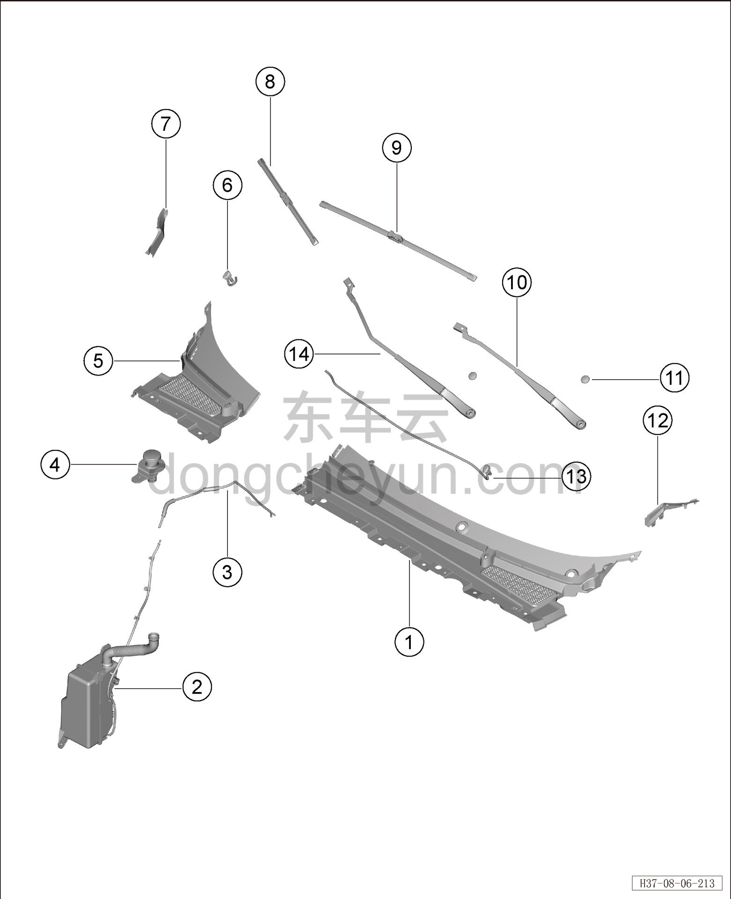

# Покомпонентный вид (деталировка)

> Внутренняя и внешняя отделка › Наружные элементы отделки › Система стеклоочистки и омывания  
> Оригинал: `结构分解图` · [dongcheyun 56746](https://dongcheyun.com/p/56746), страница `1142e99d80bf477c85d7bd976d06a202` · [оглавление](../README.md)

| № | Наименование детали | Кол-во на автомобиль | Примечание |
|---|---|---|---|
| 1 | Крышка стеклоочистителя в сборе (левая) | 1 | - |
| 2 | Бачок омывающей жидкости | 1 | - |
| 3 | Передний трубопровод | 1 | - |
| 4 | Заливная трубка | 1 | - |
| 5 | Крышка стеклоочистителя в сборе (правая) | 1 | - |
| 6 | Правая форсунка | 1 | - |
| 7 | Правое уплотнение нижней накладки ветрового стекла | 1 | - |
| 8 | Правая щётка переднего стеклоочистителя | 1 | - |
| 9 | Левая щётка переднего стеклоочистителя | 1 | - |
| 10 | Левый рычаг переднего стеклоочистителя | 1 | - |
| 11 | Колпачок оси рычага стеклоочистителя | 2 | - |
| 12 | Левое уплотнение нижней накладки ветрового стекла | 1 | - |
| 13 | Левая форсунка | 1 | - |
| 14 | Правый рычаг переднего стеклоочистителя | 1 | - |
