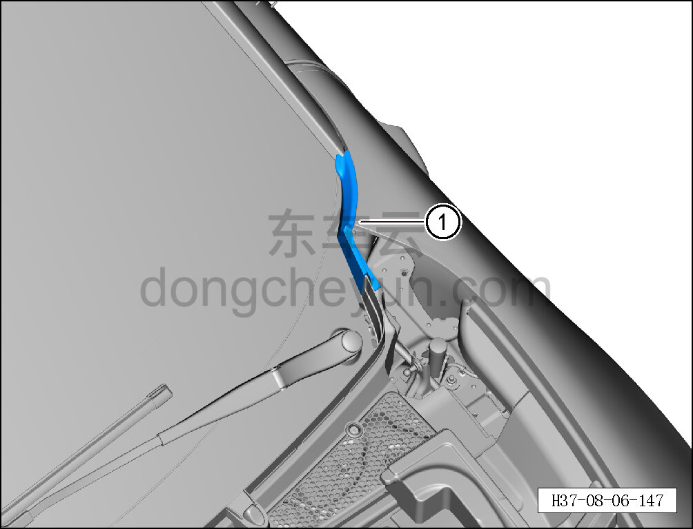

# Снятие и установка левого уплотнения нижней накладки ветрового стекла

> Внутренняя и внешняя отделка › Наружные элементы отделки › Система стеклоочистки и омывания  
> Оригинал: `拆卸与安装前风窗下盖板左密封件` · [dongcheyun 56746](https://dongcheyun.com/p/56746), страница `ef808044950d4d568d27bdb7a003fddd` · [оглавление](../README.md)

**Порядок снятия**

**Примечание:**

**- Далее описаны снятие и установка левого уплотнения нижней накладки ветрового стекла, для правой стороны действия аналогичны левой.**

1. Снимите левое уплотнение нижней накладки ветрового стекла.

a. Извлеките левое уплотнение нижней накладки ветрового стекла ①

**Порядок установки**

Установка выполняется в обратном порядке.
