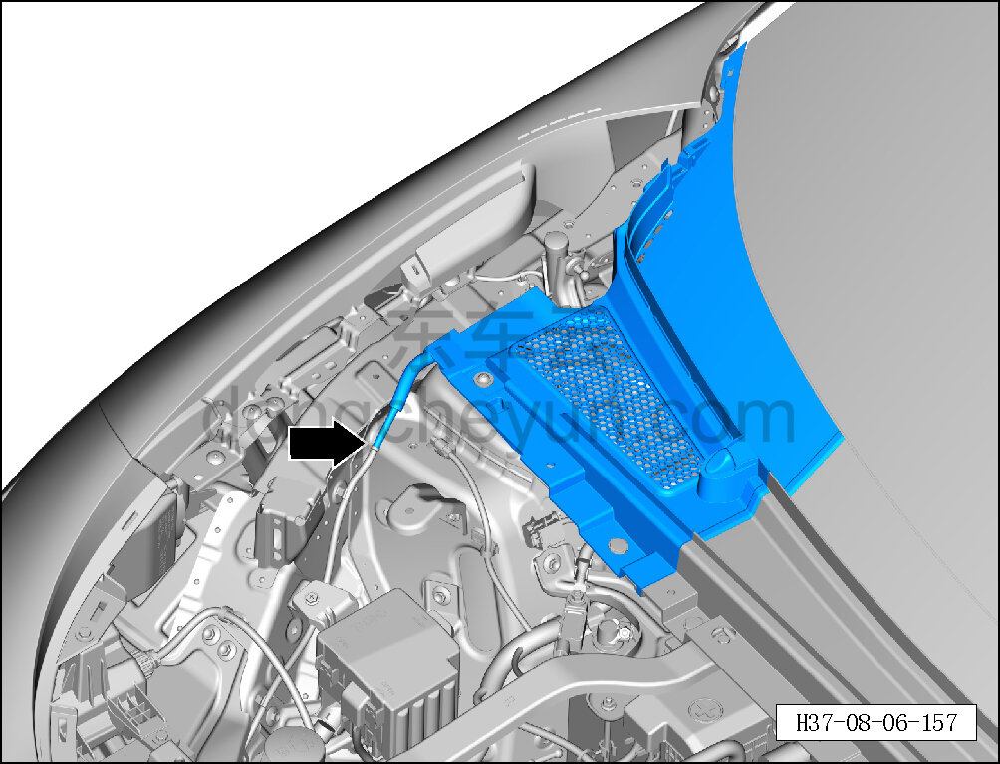
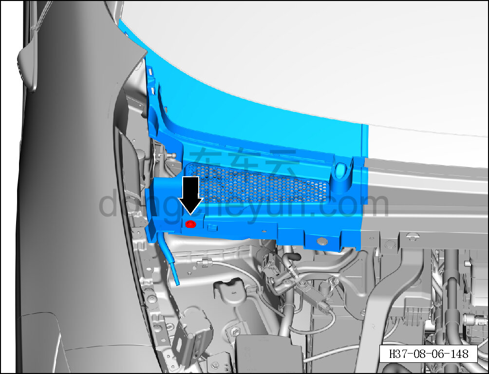
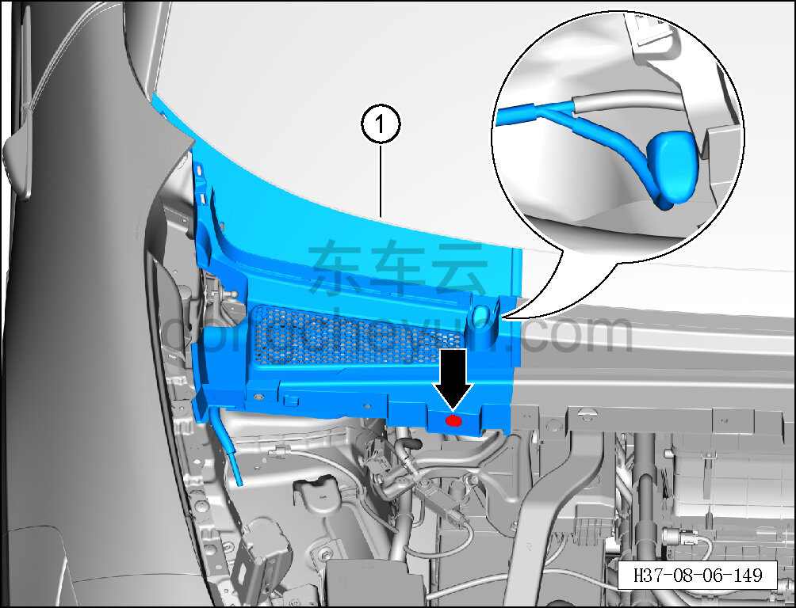

# Снятие и установка крышки стеклоочистителя в сборе (правой)

> Внутренняя и внешняя отделка › Наружные элементы отделки › Система стеклоочистки и омывания  
> Оригинал: `拆卸与安装雨刮盖板总成（右）` · [dongcheyun 56746](https://dongcheyun.com/p/56746), страница `ac4ea22ab1fe420fb3f6e7cb95f6e1a4` · [оглавление](../README.md)

**Порядок снятия**

1. Снимите декоративную накладку моторного отсека. См. [8.6.6.11 Снятие и установка декоративной накладки левого крыла](224-снятие-и-установка-декоративной-накладки-левого-крыла.md)

2. Снимите левое уплотнение нижней накладки ветрового стекла. См. [8.6.7.5 Снятие и установка левого уплотнения нижней накладки ветрового стекла](242-снятие-и-установка-левого-уплотнения-нижней-накладки.md)

3. Снимите крышку стеклоочистителя в сборе (правую).

a. Отсоедините передний трубопровод от бачка омывающей жидкости.

b. С помощью биты T25 выверните крепёжный винт крышки стеклоочистителя в сборе (правой).

Момент затяжки винта: 1.5±0.5 Н·м

c. С помощью съёмника обивки отсоедините фиксирующую клипсу крышки стеклоочистителя в сборе (правой).

d. Приподняв крышку стеклоочистителя в сборе (правую), отсоедините передний трубопровод от левой форсунки.

e. Извлеките крышку стеклоочистителя в сборе (правую) ①.

**Порядок установки**

Установка выполняется в обратном порядке.

**Внимание:**

**- После завершения установки проверьте форсунки и трубопроводы на отсутствие засорения, проверьте нормальную работу стеклоочистителя.**

**- После завершения установки проверьте, что крышка стеклоочистителя в сборе установлена ровно, без перекосов и отставаний.**
