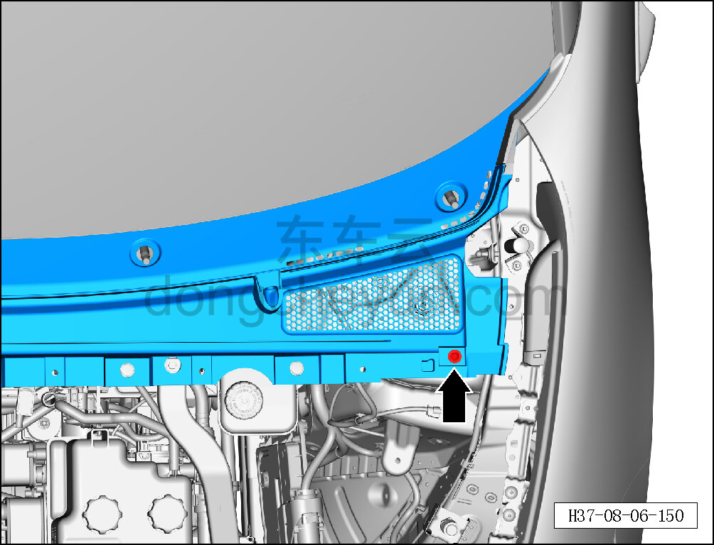
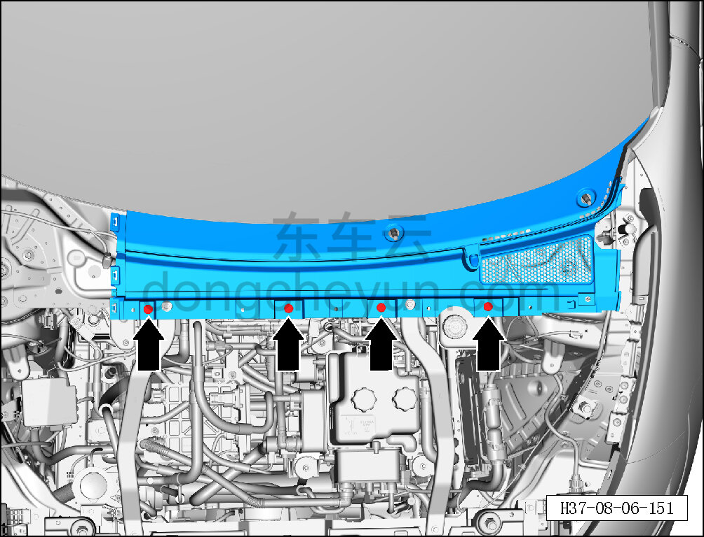
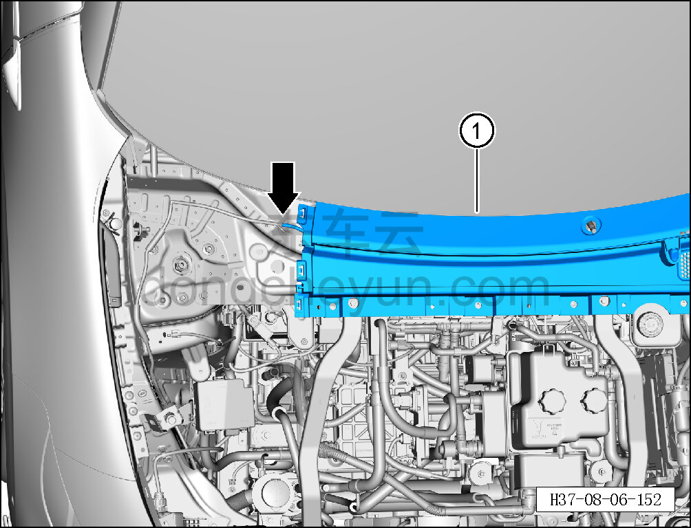

# Снятие и установка крышки стеклоочистителя в сборе (левой)

> Внутренняя и внешняя отделка › Наружные элементы отделки › Система стеклоочистки и омывания  
> Оригинал: `拆卸与安装雨刮盖板总成（左）` · [dongcheyun 56746](https://dongcheyun.com/p/56746), страница `d017b3b5925d48d88e702e5fc6adfe30` · [оглавление](../README.md)

**Порядок снятия**

1. Снимите крышку стеклоочистителя в сборе (правую). См. [8.6.7.6 Снятие и установка крышки стеклоочистителя в сборе (правой)](243-снятие-и-установка-крышки-стеклоочистителя-в-сборе.md)

2. Снимите левое уплотнение нижней накладки ветрового стекла. См. [8.6.7.5 Снятие и установка левого уплотнения нижней накладки ветрового стекла](242-снятие-и-установка-левого-уплотнения-нижней-накладки.md)

3. Снимите левый и правый рычаги переднего стеклоочистителя. См. [8.6.7.9 Снятие и установка левого рычага переднего стеклоочистителя](246-снятие-и-установка-левого-рычага-переднего.md)

4. Снимите крышку стеклоочистителя в сборе (левую).

a. С помощью биты T25 выверните крепёжный винт крышки стеклоочистителя в сборе (левой).

Момент затяжки винта: 1.5±0.5 Н·м

b. С помощью съёмника обивки отсоедините 4 фиксирующие клипсы крышки стеклоочистителя в сборе (левой).

c. Отсоедините левую форсунку от переднего трубопровода.

d. Извлеките крышку стеклоочистителя в сборе (левую) ①.

**Порядок установки**

Установка выполняется в обратном порядке.

**Внимание:**

**- При установке запрещается ударять по узлу декоративной накладки резиновым молотком, чтобы не повредить ветровое стекло.**

**- После завершения установки проверьте, что крышка стеклоочистителя в сборе установлена ровно, без перекосов и отставаний.**

**- Проверьте форсунки и трубопроводы на отсутствие засорения, проверьте нормальную работу стеклоочистителя.**
