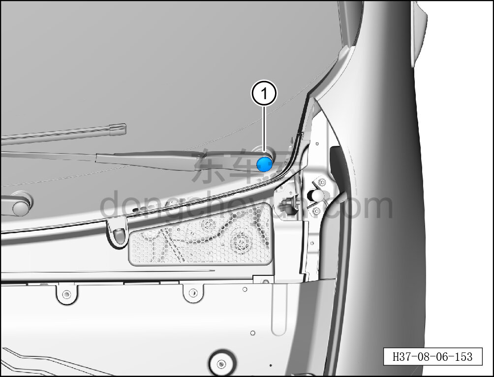

# Снятие и установка колпачка оси рычага стеклоочистителя

> Внутренняя и внешняя отделка › Наружные элементы отделки › Система стеклоочистки и омывания  
> Оригинал: `拆卸与安装雨刮臂轴罩` · [dongcheyun 56746](https://dongcheyun.com/p/56746), страница `1ffbe44cdf014bda8f050dff490fcc57` · [оглавление](../README.md)

**Порядок снятия**

**Примечание:**

**- Далее описаны снятие и установка левого колпачка оси рычага стеклоочистителя, для правой стороны действия аналогичны левой.**

1. Снимите левый колпачок оси рычага стеклоочистителя.

a. С помощью съёмника обивки отсоедините левый колпачок оси рычага стеклоочистителя ①.

**Порядок установки**

Установка выполняется в обратном порядке.
