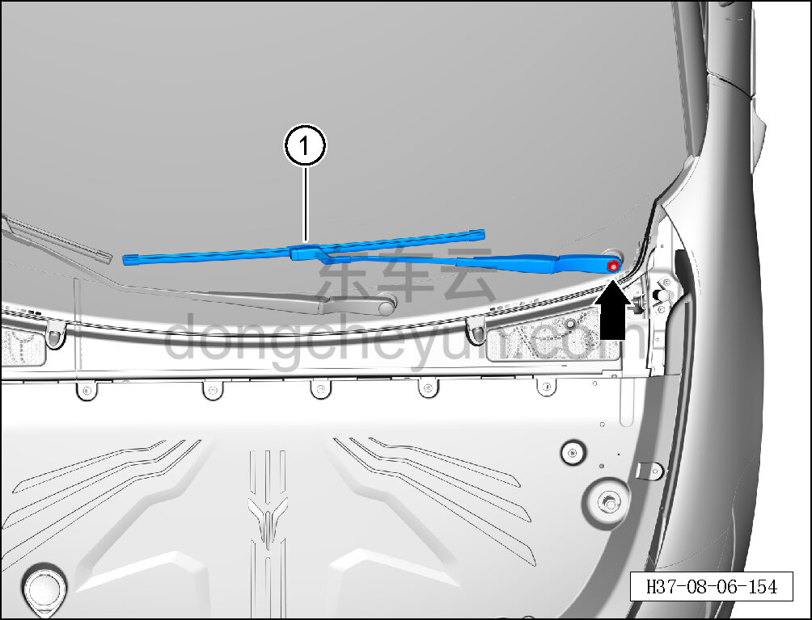
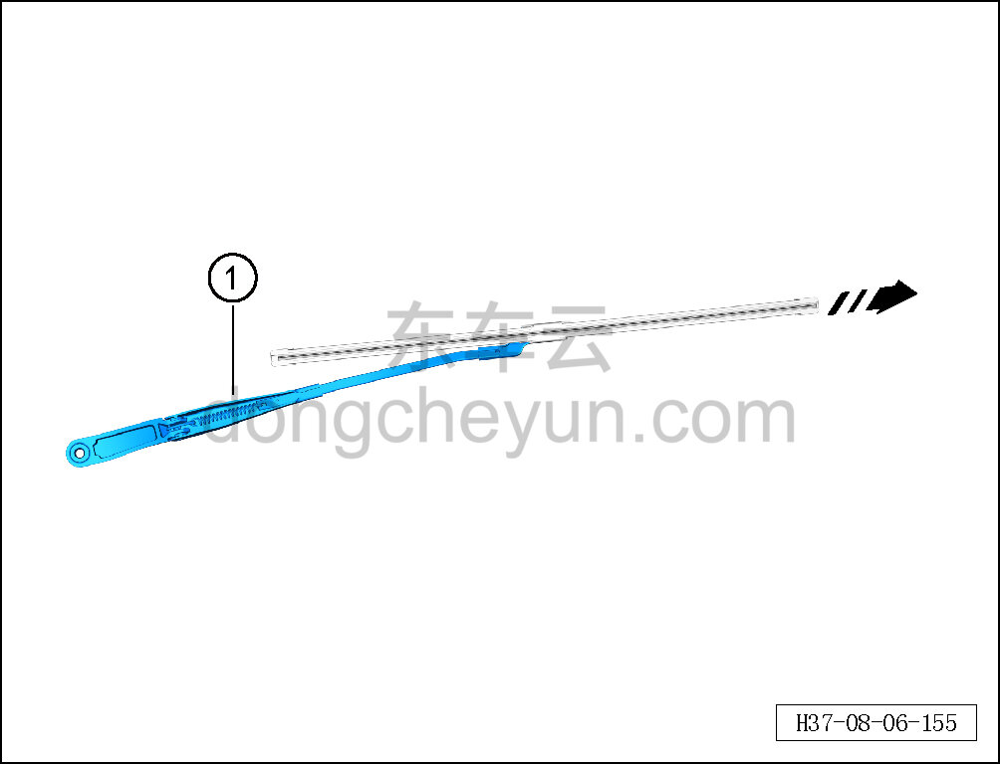

# Снятие и установка левого рычага переднего стеклоочистителя

> Внутренняя и внешняя отделка › Наружные элементы отделки › Система стеклоочистки и омывания  
> Оригинал: `拆卸与安装左前雨刮臂` · [dongcheyun 56746](https://dongcheyun.com/p/56746), страница `d86e4a97644e487aae96ab95f9c7d024` · [оглавление](../README.md)

**Порядок снятия**

**Примечание:**

**- Далее описаны снятие и установка левого рычага переднего стеклоочистителя, для правой стороны действия аналогичны левой.**

1. Снимите левый колпачок оси рычага стеклоочистителя. См. [8.6.7.8 Снятие и установка колпачка оси рычага стеклоочистителя](245-снятие-и-установка-колпачка-оси-рычага-стеклоочистителя.md)

2. Снимите левый рычаг переднего стеклоочистителя.

a. С помощью торцевой головки на 15 мм отверните крепёжную гайку левого рычага переднего стеклоочистителя.

Момент затяжки гайки: 25±3 Н·м

b. С помощью съёмника рычагов стеклоочистителя (H52203000) снимите левый рычаг переднего стеклоочистителя вместе с левой щёткой переднего стеклоочистителя ①.

c. Нажмите кнопку отсоединения и, двигаясь по направлению стрелки, отсоедините левую щётку переднего стеклоочистителя.

d. Снимите левый рычаг переднего стеклоочистителя ①.

**Порядок установки**

Установка выполняется в обратном порядке.

**Внимание:**

**- При установке рычага и щётки стеклоочистителя учитывайте, что их устанавливают раздельно на левую и правую сторону. Проверьте и отрегулируйте положение установки щётки стеклоочистителя.**

**- После завершения установки проверьте, что зона протирки в норме.**
