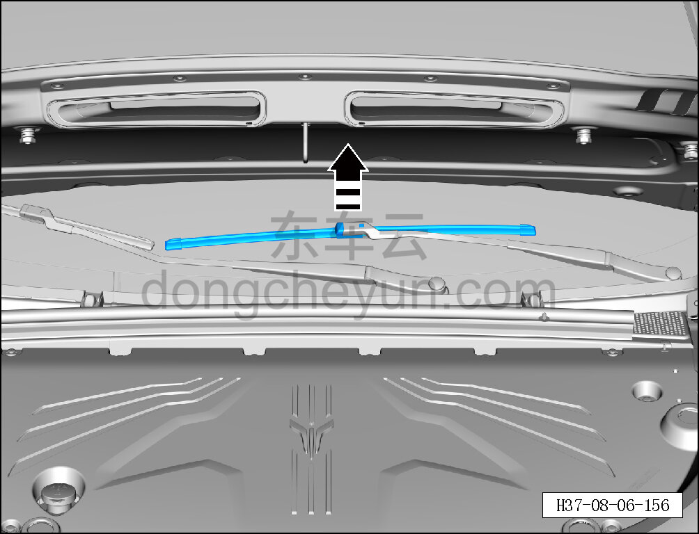
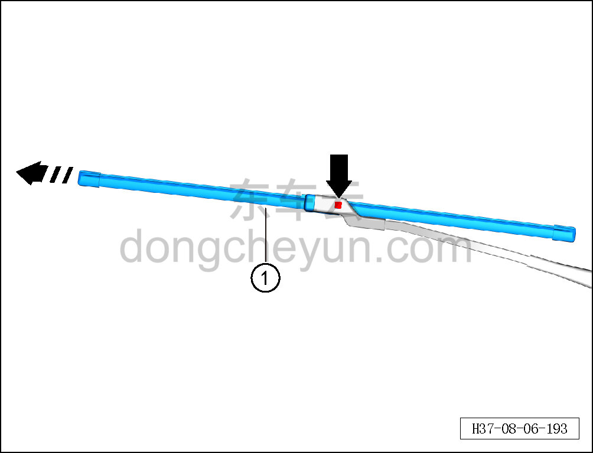

# Снятие и установка левой щётки переднего стеклоочистителя

> Внутренняя и внешняя отделка › Наружные элементы отделки › Система стеклоочистки и омывания  
> Оригинал: `拆卸与安装左前雨刮片` · [dongcheyun 56746](https://dongcheyun.com/p/56746), страница `7ef16654520142e2a7b758cba5110d39` · [оглавление](../README.md)

**Порядок снятия**

**Примечание:**

**- Далее описаны снятие и установка левой щётки переднего стеклоочистителя, для правой стороны действия аналогичны левой.**

1. Откройте капот в сборе.

2. Снимите левую щётку переднего стеклоочистителя.

a. Поднимите левую щётку переднего стеклоочистителя в направлении стрелки.

**Внимание:**

**- Положите на стекло полотенце, чтобы стеклоочиститель при внезапном падении не повредил стекло.**

b. Нажмите кнопку отсоединения и в направлении стрелки отсоедините левую

щётку переднего стеклоочистителя.

c. Извлеките левую щётку переднего стеклоочистителя ①.

**Порядок установки**

Установка выполняется в обратном порядке.

**Внимание:**

**- При установке рычага и щётки стеклоочистителя учитывайте, что их устанавливают раздельно на левую и правую сторону. Проверьте и отрегулируйте положение установки щётки стеклоочистителя.**

**- После завершения установки проверьте, что зона протирки в норме.**
