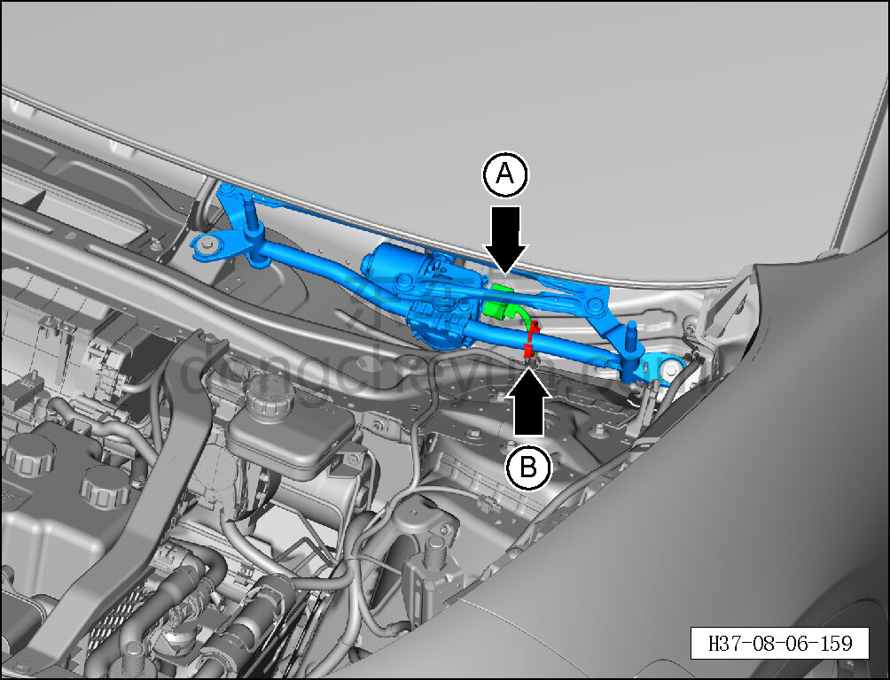
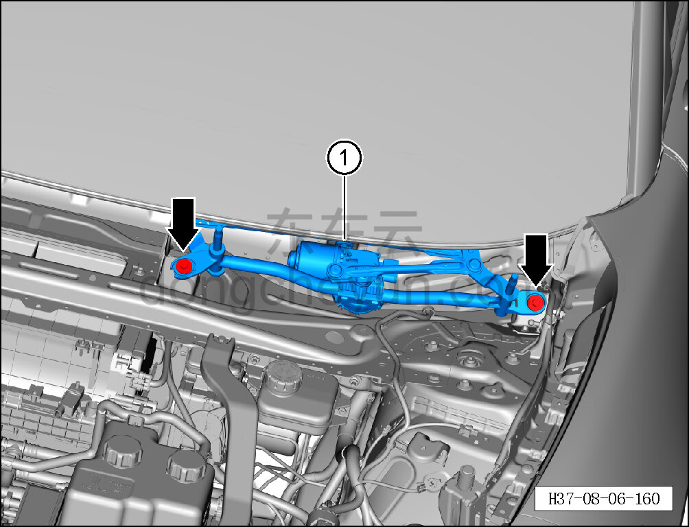

# Снятие и установка привода переднего стеклоочистителя

> Внутренняя и внешняя отделка › Наружные элементы отделки › Система стеклоочистки и омывания  
> Оригинал: `拆卸与安装前雨刮传动机构` · [dongcheyun 56746](https://dongcheyun.com/p/56746), страница `da629d67aded451297f5b7b723e0ea29` · [оглавление](../README.md)

**Порядок снятия**

1. Выключите все электроприборы, отключите питание.

2. Выполните операцию обесточивания автомобиля для ремонта. См. [3.1.4.1 Обесточивание автомобиля](../03-техническое-обслуживание/005-обесточивание-автомобиля.md)

3. Снимите крышку стеклоочистителя в сборе (левую). См. [8.6.7.7 Снятие и установка крышки стеклоочистителя в сборе (левой)](244-снятие-и-установка-крышки-стеклоочистителя-в-сборе.md)

4. Снимите привод переднего стеклоочистителя.

a. Нажав на фиксатор разъёма, отсоедините разъём A привода переднего стеклоочистителя от жгута проводов кузова.

b. С помощью съёмника обивки отсоедините хомут B жгута проводов кузова.

c. С помощью торцевой головки на 10 мм выверните 2 крепёжных болта привода переднего стеклоочистителя.

Момент затяжки болта: 8±1 Н·м

d. Извлеките привод переднего стеклоочистителя ①.

**Порядок установки**

Установка выполняется в обратном порядке.

**Внимание:**

**- После завершения установки проверьте, что зона протирки в норме.**
