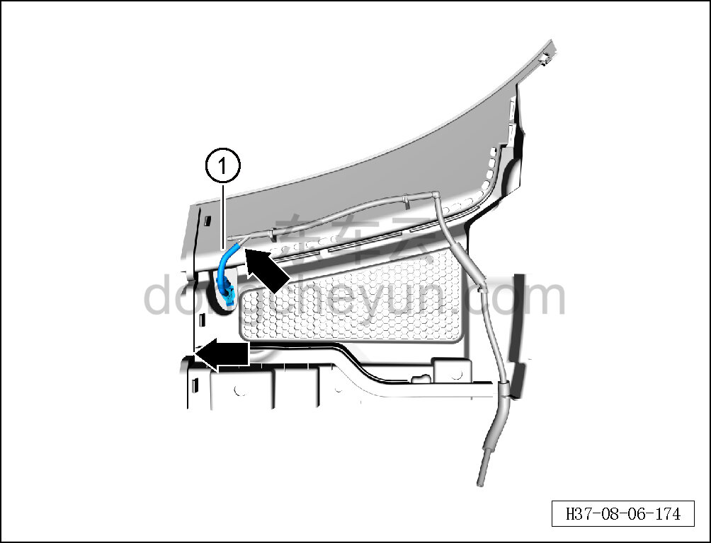

# Снятие и установка правой форсунки

> Внутренняя и внешняя отделка › Наружные элементы отделки › Система стеклоочистки и омывания  
> Оригинал: `拆卸与安装右喷嘴` · [dongcheyun 56746](https://dongcheyun.com/p/56746), страница `108474d8e11b4f6ba25da0b009bd96fb` · [оглавление](../README.md)

**Порядок снятия**

1. Снимите крышку стеклоочистителя в сборе (правую). См. [8.6.7.6 Снятие и установка крышки стеклоочистителя в сборе (правой)](243-снятие-и-установка-крышки-стеклоочистителя-в-сборе.md)

2. Снимите правую форсунку.

a. Отсоедините правую форсунку от переднего трубопровода, извлеките правую форсунку ①.

**Порядок установки**

Установка выполняется в обратном порядке.

**Внимание:**

**- После завершения установки проверьте, что дальность распыления форсунки соответствует норме, и отсутствие засорения.**
