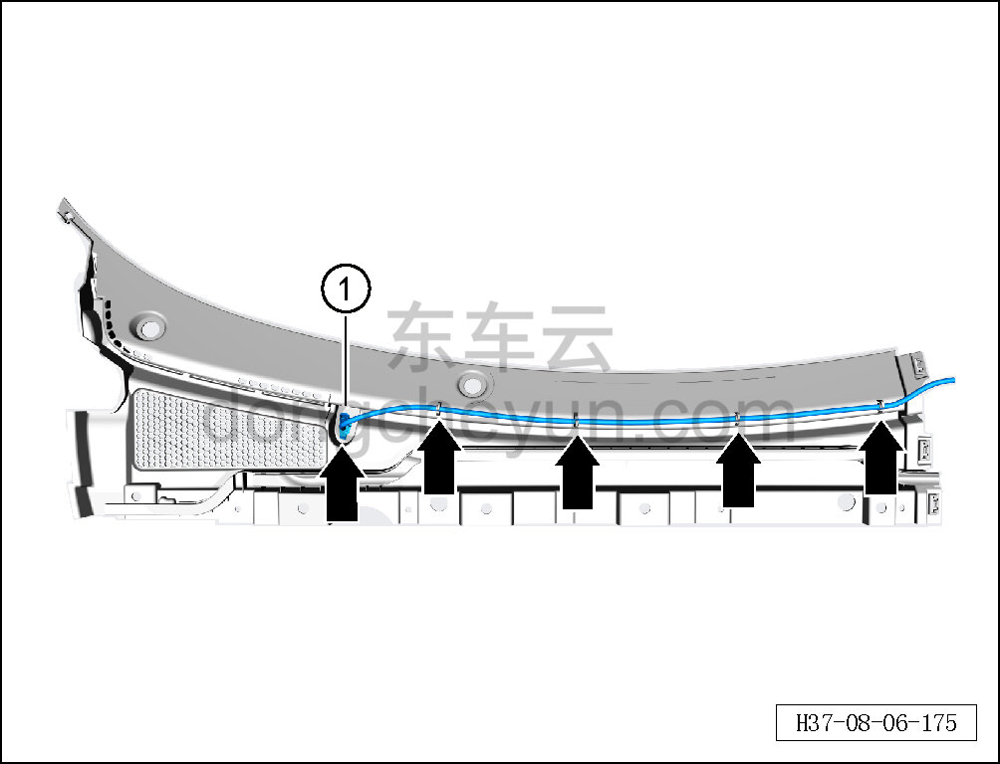

# Снятие и установка левой форсунки

> Внутренняя и внешняя отделка › Наружные элементы отделки › Система стеклоочистки и омывания  
> Оригинал: `拆卸与安装左喷嘴` · [dongcheyun 56746](https://dongcheyun.com/p/56746), страница `375fa2b0dc0a43658e6cd4d1f43952de` · [оглавление](../README.md)

**Порядок снятия**

1. Снимите крышку стеклоочистителя в сборе (левую). См. [8.6.7.7 Снятие и установка крышки стеклоочистителя в сборе (левой)](244-снятие-и-установка-крышки-стеклоочистителя-в-сборе.md)

2. Снимите левую форсунку.

a. Отсоедините водяную трубку левой форсунки от крышки стеклоочистителя в сборе (левой).

b. Снимите левую форсунку ①.

**Порядок установки**

Установка выполняется в обратном порядке.

**Внимание:**

**- После завершения установки проверьте, что дальность распыления форсунки соответствует норме, и отсутствие засорения.**
