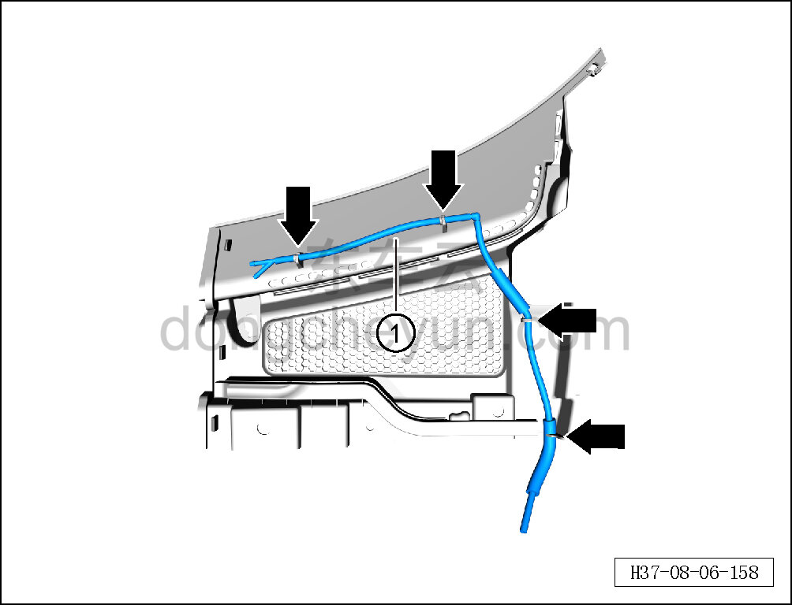

# Снятие и установка переднего трубопровода

> Внутренняя и внешняя отделка › Наружные элементы отделки › Система стеклоочистки и омывания  
> Оригинал: `拆卸与安装前管路` · [dongcheyun 56746](https://dongcheyun.com/p/56746), страница `31bb6bcbd414493484491ec631043bd6` · [оглавление](../README.md)

**Порядок снятия**

1. Снимите правую форсунку. См. [8.6.7.12 Снятие и установка правой форсунки](249-снятие-и-установка-правой-форсунки.md)

2. Снимите передний трубопровод.

a. Отсоедините передний трубопровод от крышки стеклоочистителя в сборе (правой).

b. Извлеките передний трубопровод ①.

**Порядок установки**

Установка выполняется в обратном порядке.

**Внимание:**

**- После завершения установки проверьте трубопровод в сборе на отсутствие засорения, проверьте нормальную подачу жидкости.**
