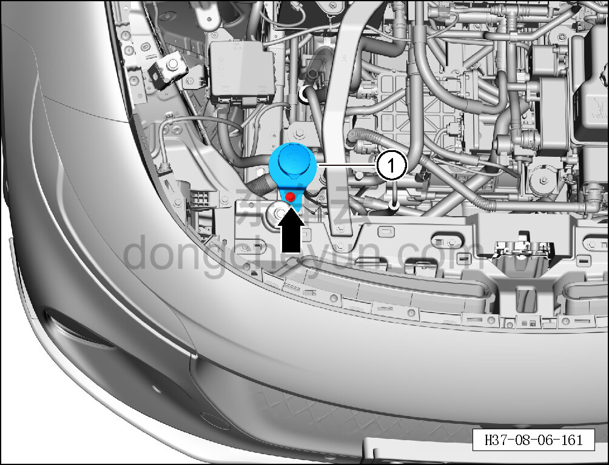

# Снятие и установка заливной трубки

> Внутренняя и внешняя отделка › Наружные элементы отделки › Система стеклоочистки и омывания  
> Оригинал: `拆卸与安装加液管` · [dongcheyun 56746](https://dongcheyun.com/p/56746), страница `b6b280221bf6439787282961e4fc5ab7` · [оглавление](../README.md)

**Порядок снятия**

1. Снимите декоративную накладку моторного отсека. См. [8.6.6.10 Снятие и установка декоративной накладки моторного отсека](223-снятие-и-установка-декоративной-накладки-моторного.md)

2. Снимите заливную трубку.

a. С помощью торцевой головки на 10 мм выверните крепёжный болт заливной трубки.

Момент затяжки болта: 6±1 Н·м

b. Извлеките заливную трубку ①.

**Порядок установки**

Установка выполняется в обратном порядке.

**Внимание:**

**- После завершения установки проверьте надёжность установки заливной трубки, залейте омывающую жидкость до отметки MAX.**
