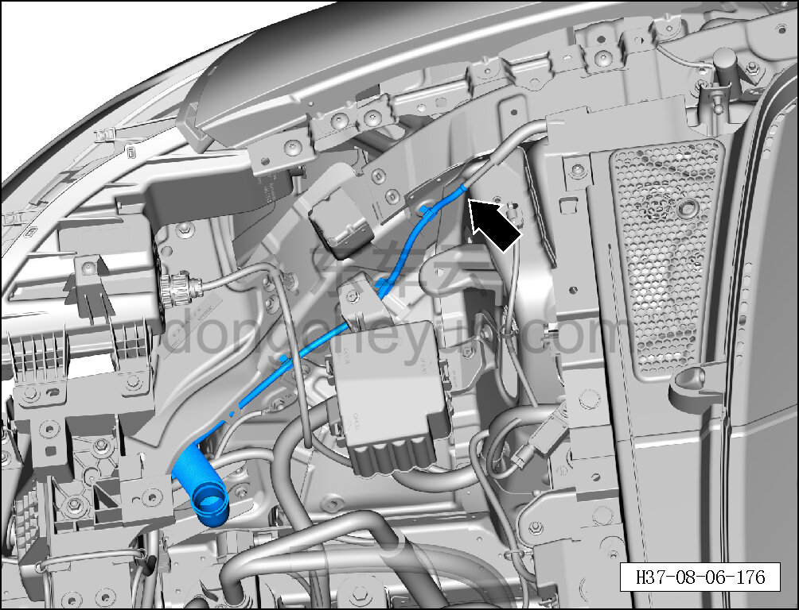
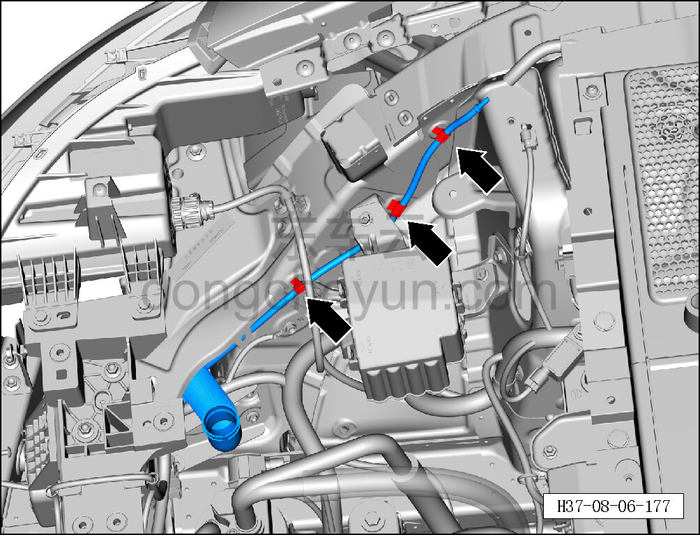
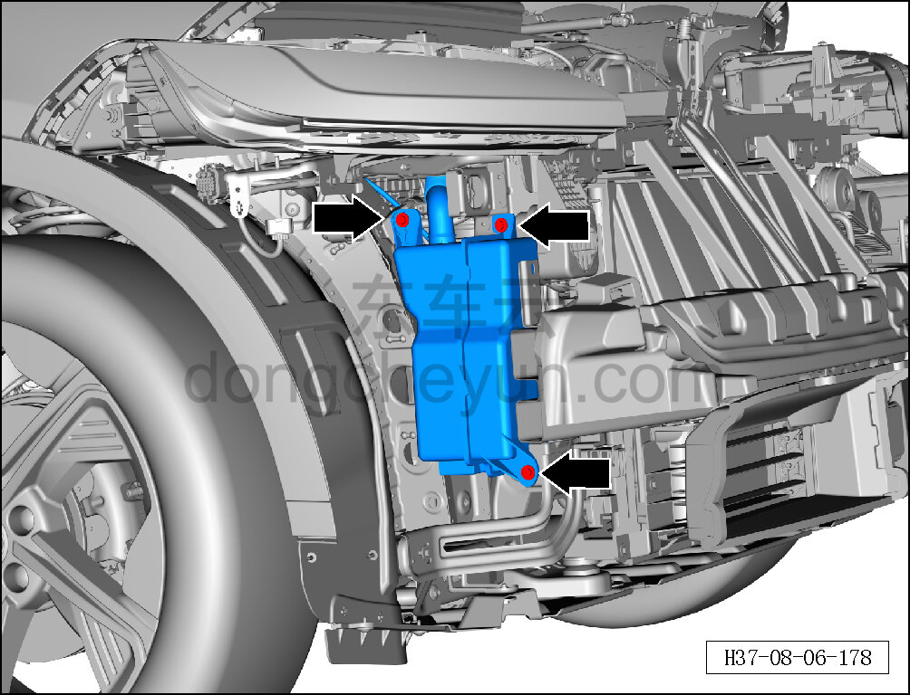
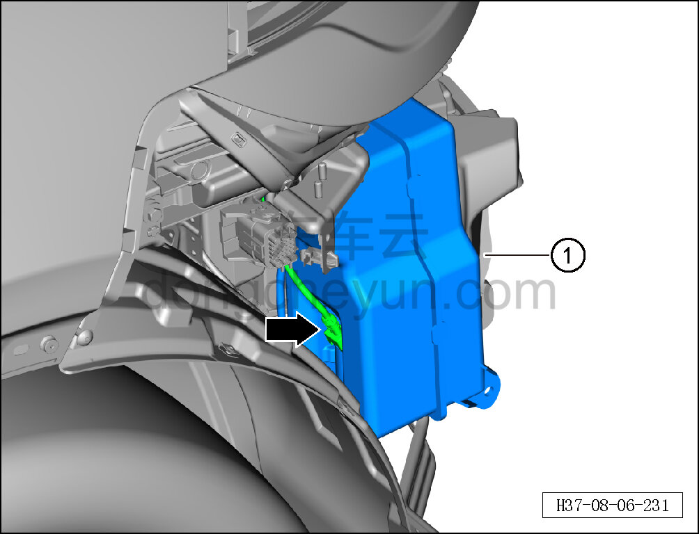

# Снятие и установка бачка омывающей жидкости

> Внутренняя и внешняя отделка › Наружные элементы отделки › Система стеклоочистки и омывания  
> Оригинал: `拆卸与安装清洗剂储液罐` · [dongcheyun 56746](https://dongcheyun.com/p/56746), страница `9b03e8be1c364ea888eb4d36b3e06396` · [оглавление](../README.md)

**Порядок снятия**

1. Выключите все электроприборы, отключите питание.

2. Выполните операцию обесточивания автомобиля для ремонта. См. [3.1.4.1 Обесточивание автомобиля](../03-техническое-обслуживание/005-обесточивание-автомобиля.md)

3. Снимите декоративную накладку моторного отсека. См. [8.6.6.10 Снятие и установка декоративной накладки моторного отсека](223-снятие-и-установка-декоративной-накладки-моторного.md)

4. Снимите передний бампер в сборе. См. [8.6.3.3 Снятие и установка переднего бампера в сборе](163-снятие-и-установка-переднего-бампера-в-сборе.md)

5. Снимите правую фару. См. [9.9.3.2 Снятие и установка фары (левой)](../09-электрическая-и-электронная-система/078-снятие-и-установка-фары-левой.md)

6. Снимите бачок омывающей жидкости.

a. Отсоедините водяную трубку, соединяющую бачок омывающей жидкости с передним трубопроводом.

b. С помощью съёмника обивки отсоедините 3 фиксирующие клипсы бачка омывающей жидкости.

c. С помощью торцевой головки на 10 мм выверните 3 крепёжных болта бачка омывающей жидкости.

Момент затяжки болта: 6±1 Н·м

d. Сначала отогните фиксатор разъёма, затем отсоедините разъём бачка омывающей жидкости.

e. Извлеките бачок омывающей жидкости ①.

**Порядок установки**

Установка выполняется в обратном порядке.

**Внимание:**

**- После завершения установки проверьте нормальную работу бачка омывающей жидкости, залейте омывающую жидкость до отметки MAX.**
