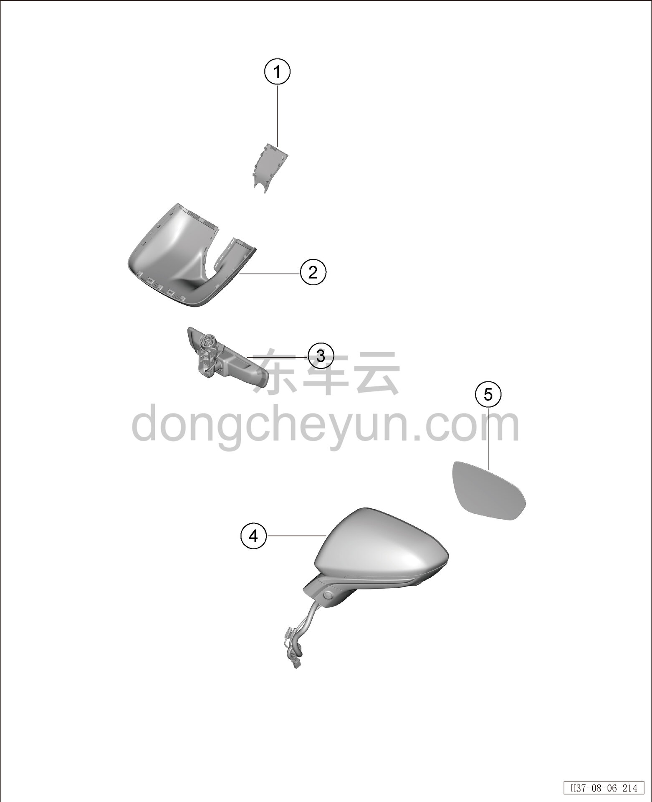

# Покомпонентный вид (деталировка)

> Внутренняя и внешняя отделка › Наружные элементы отделки › Система зеркал заднего вида  
> Оригинал: `结构分解图` · [dongcheyun 56746](https://dongcheyun.com/p/56746), страница `41e4048ad9624517a75b3f22538140d2` · [оглавление](../README.md)

| № | Наименование детали | Кол-во на автомобиль | Примечание |
|---|---|---|---|
| 1 | Передний декоративный кожух внутреннего зеркала заднего вида | 1 | - |
| 2 | Задний декоративный кожух внутреннего зеркала заднего вида | 1 | - |
| 3 | Внутреннее зеркало заднего вида | 1 | - |
| 4 | Наружное зеркало заднего вида в сборе | 1 | - |
| 5 | Зеркальный элемент левого наружного зеркала заднего вида | 1 | - |
