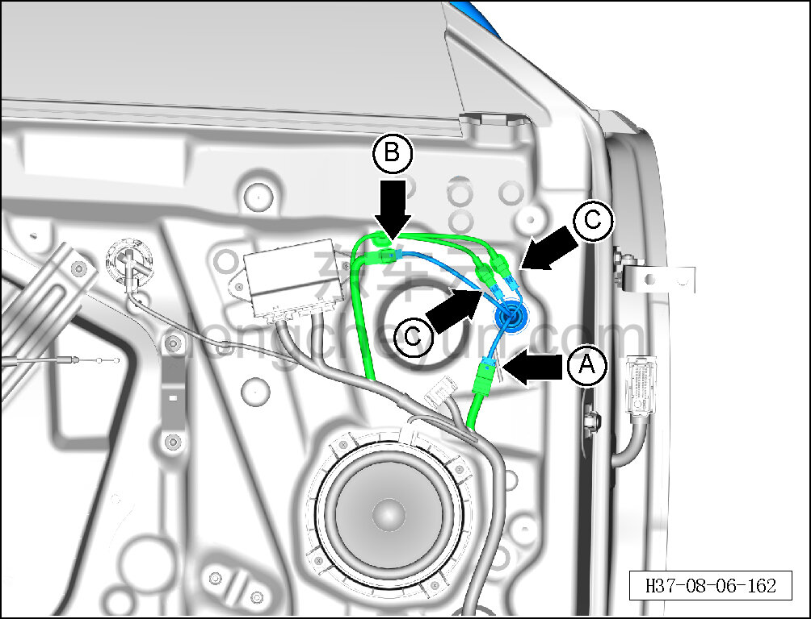
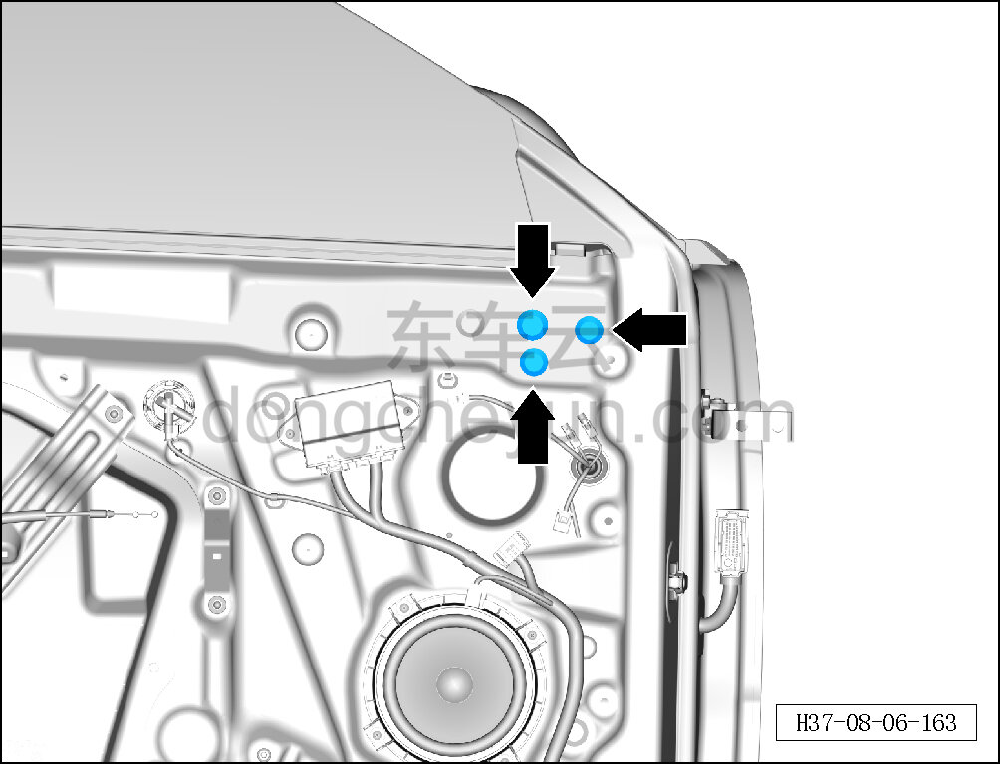
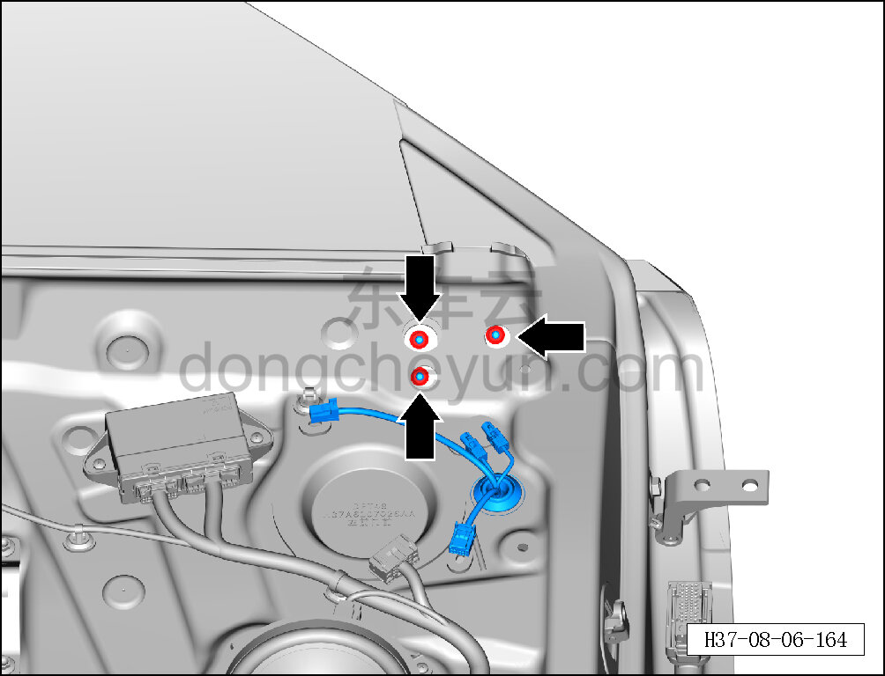
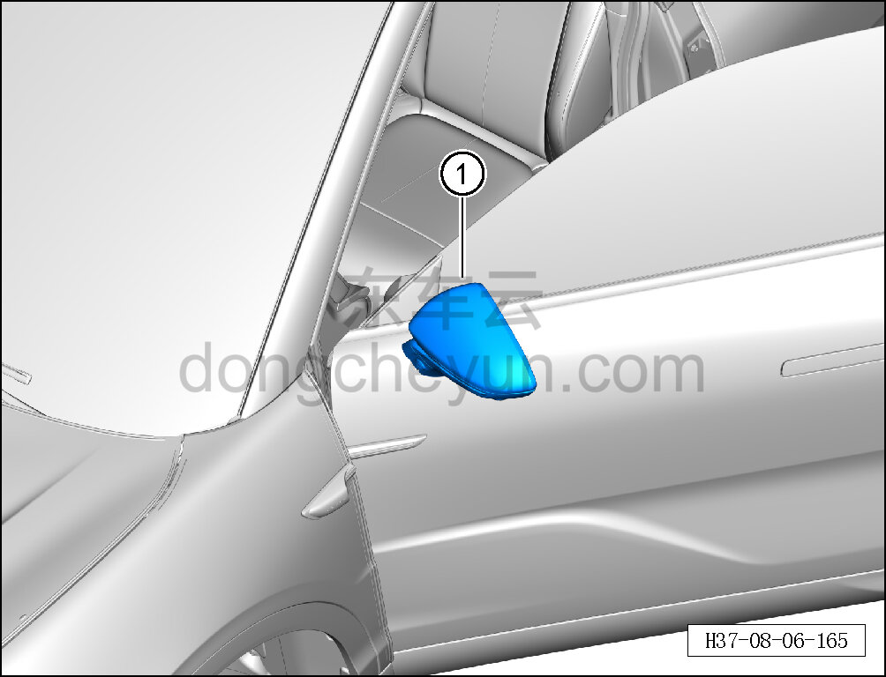

# Снятие и установка левого наружного зеркала заднего вида

> Внутренняя и внешняя отделка › Наружные элементы отделки › Система зеркал заднего вида  
> Оригинал: `拆卸与安装左外后视镜` · [dongcheyun 56746](https://dongcheyun.com/p/56746), страница `4163c41dafdc43d491b842fc67eb6fe0` · [оглавление](../README.md)

**Порядок снятия**

**Примечание:**

**- Далее описаны снятие и установка левого наружного зеркала заднего вида, для правой стороны действия аналогичны левой.**

1. Выключите все электроприборы, отключите питание.

2. Выполните операцию обесточивания автомобиля для ремонта. См. [3.1.4.1 Обесточивание автомобиля](../03-техническое-обслуживание/005-обесточивание-автомобиля.md)

3. Снимите внутреннюю обивку левой передней двери. См. [8.4.2.1 Снятие и установка внутренней обивки левой передней двери](117-снятие-и-установка-обивки-левой-передней-двери.md)

4. Снимите левое наружное зеркало заднего вида.

a. Отсоедините разъём A жгута проводов наружного зеркала заднего вида.

b. Отсоедините разъём B жгута проводов наружного зеркала заднего вида.

c. Отсоедините разъём C жгута проводов левой камеры кругового обзора.

d. С помощью съёмника обивки снимите 3 заглушки левого наружного зеркала заднего вида.

e. С помощью торцевой головки на 10 мм отверните 3 крепёжные гайки левого наружного зеркала заднего вида.

Момент затяжки гайки: 9±2 Н·м

f. Извлеките левое наружное зеркало заднего вида ①.

**Порядок установки**

Установка выполняется в обратном порядке.

**Внимание:**

**- После завершения установки выполните функциональную проверку наружного зеркала заднего вида.**
