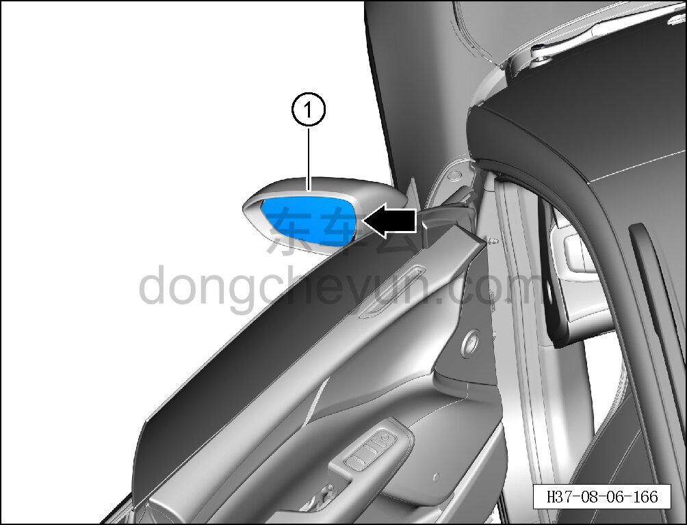

# Снятие и установка зеркального элемента левого наружного зеркала заднего вида

> Внутренняя и внешняя отделка › Наружные элементы отделки › Система зеркал заднего вида  
> Оригинал: `拆卸与安装左外后视镜镜片` · [dongcheyun 56746](https://dongcheyun.com/p/56746), страница `bde1fca3406f415b9cae8da52c153d2c` · [оглавление](../README.md)

**Порядок снятия**

**Примечание:**

**- Далее описаны снятие и установка зеркального элемента левого наружного зеркала заднего вида, для правой стороны действия аналогичны левой.**

1. Снимите зеркальный элемент левого наружного зеркала заднего вида.

a. С помощью съёмника обивки, вставив его в зазор между зеркальным элементом и корпусом левого наружного зеркала заднего вида, отогните зеркальный элемент с правой стороны.

b. Извлеките зеркальный элемент левого наружного зеркала заднего вида ①.

**Внимание:**

**- При снятии медленно отжимайте зеркальный элемент левого наружного зеркала заднего вида.**

**Порядок установки**

Установка выполняется в обратном порядке.

**Внимание:**

**- Вдавите его в блок регулировки зеркала до щелчка, подтверждающего фиксацию зеркального элемента.**

**- После завершения установки выполните функциональную проверку.**
