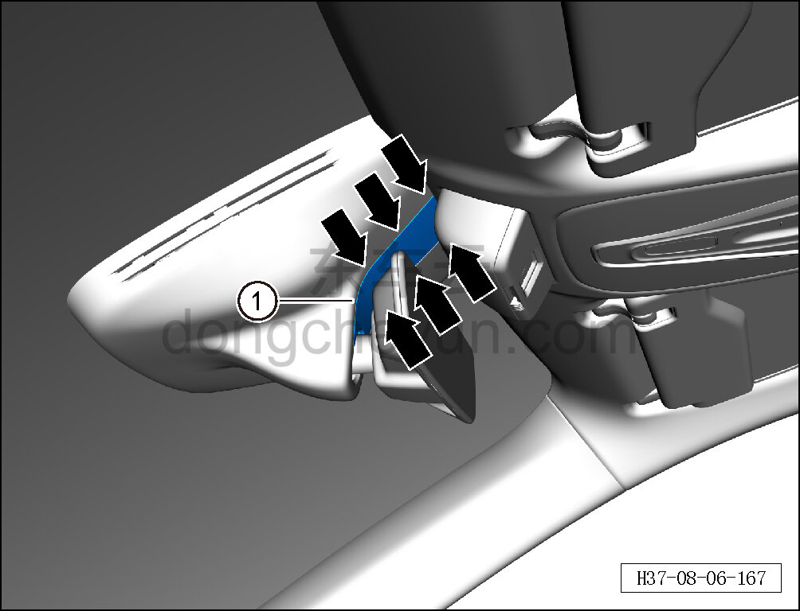
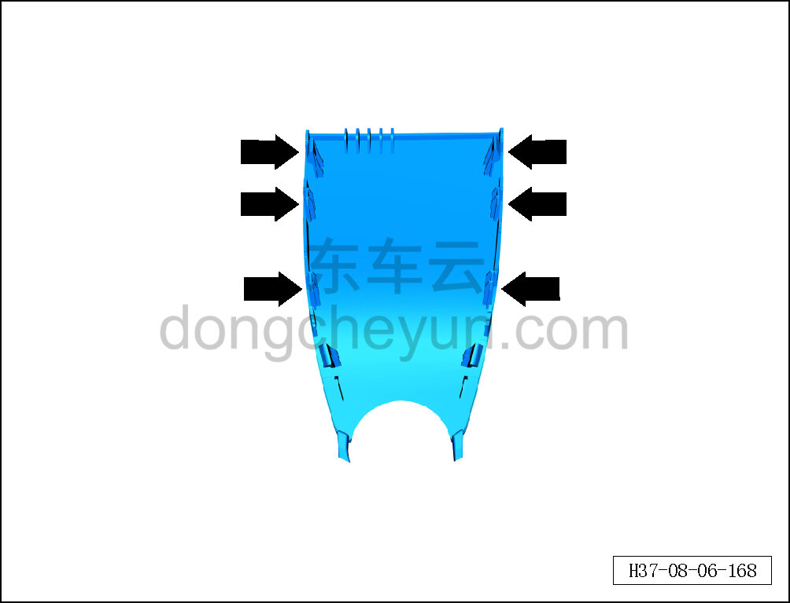

# Снятие и установка переднего декоративного кожуха внутреннего зеркала заднего вида

> Внутренняя и внешняя отделка › Наружные элементы отделки › Система зеркал заднего вида  
> Оригинал: `拆卸与安装内后视镜前装饰罩` · [dongcheyun 56746](https://dongcheyun.com/p/56746), страница `30dcf1855b01467582ef91ffd91227c8` · [оглавление](../README.md)

**Порядок снятия**

1. Снимите передний декоративный кожух внутреннего зеркала заднего вида.

a. С помощью съёмника обивки отсоедините 6 фиксирующих клипс переднего декоративного кожуха внутреннего зеркала заднего вида.

b. Извлеките передний декоративный кожух внутреннего зеркала заднего вида ①.

**Внимание:**

**- При отжиме декоративного кожуха инструментом для снятия обивки можно подложить под инструмент нетканый материал, чтобы избежать повреждения окружающих элементов интерьера в процессе снятия.**

c. Расположение фиксирующих клипс переднего декоративного кожуха внутреннего зеркала заднего вида показано на рисунке слева.

**Порядок установки**

Установка выполняется в обратном порядке.

**Внимание:**

**-Проверьте крепёжные клипсы на отсутствие повреждений, при необходимости замените.**

**- После завершения установки проверьте, что передний декоративный кожух внутреннего зеркала заднего вида установлен ровно, без перекосов и отставаний.**
