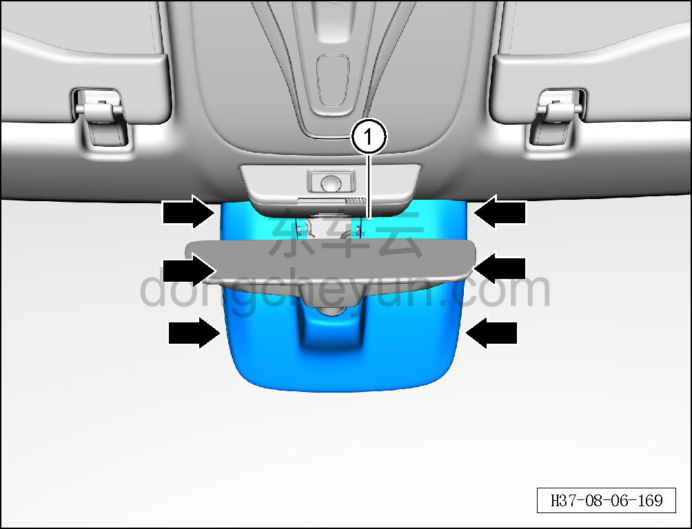
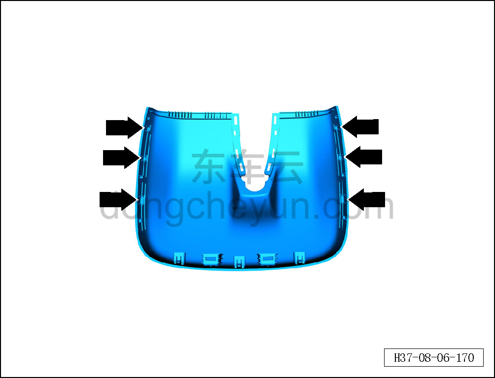

# Снятие и установка заднего декоративного кожуха внутреннего зеркала заднего вида

> Внутренняя и внешняя отделка › Наружные элементы отделки › Система зеркал заднего вида  
> Оригинал: `拆卸与安装内后视镜后装饰罩` · [dongcheyun 56746](https://dongcheyun.com/p/56746), страница `08ddac98ac2a4a4ba64456db6fed43c5` · [оглавление](../README.md)

**Порядок снятия**

1. Выключите все электроприборы, отключите питание.

2. Выполните операцию обесточивания автомобиля для ремонта. См. [3.1.4.1 Обесточивание автомобиля](../03-техническое-обслуживание/005-обесточивание-автомобиля.md)

3. Снимите передний декоративный кожух внутреннего зеркала заднего вида. См. [8.6.8.7 Снятие и установка переднего декоративного кожуха внутреннего зеркала заднего вида](260-снятие-и-установка-переднего-декоративного-кожуха.md)

4. Снимите задний декоративный кожух внутреннего зеркала заднего вида.

a. С помощью съёмника обивки отсоедините 6 фиксирующих клипс заднего декоративного кожуха внутреннего зеркала заднего вида.

b. Извлеките задний декоративный кожух внутреннего зеркала заднего вида ①.

**Внимание:**

**- При отжиме декоративного кожуха инструментом для снятия обивки можно подложить под инструмент нетканый материал, чтобы избежать повреждения окружающего стекла в процессе снятия.**

c. Расположение фиксирующих клипс заднего декоративного кожуха внутреннего зеркала заднего вида показано на рисунке слева.

**Порядок установки**

Установка выполняется в обратном порядке.

**Внимание:**

**-Проверьте крепёжные клипсы на отсутствие повреждений, при необходимости замените.**

**- После завершения установки проверьте, что задний декоративный кожух внутреннего зеркала заднего вида установлен надёжно, без отставаний.**
