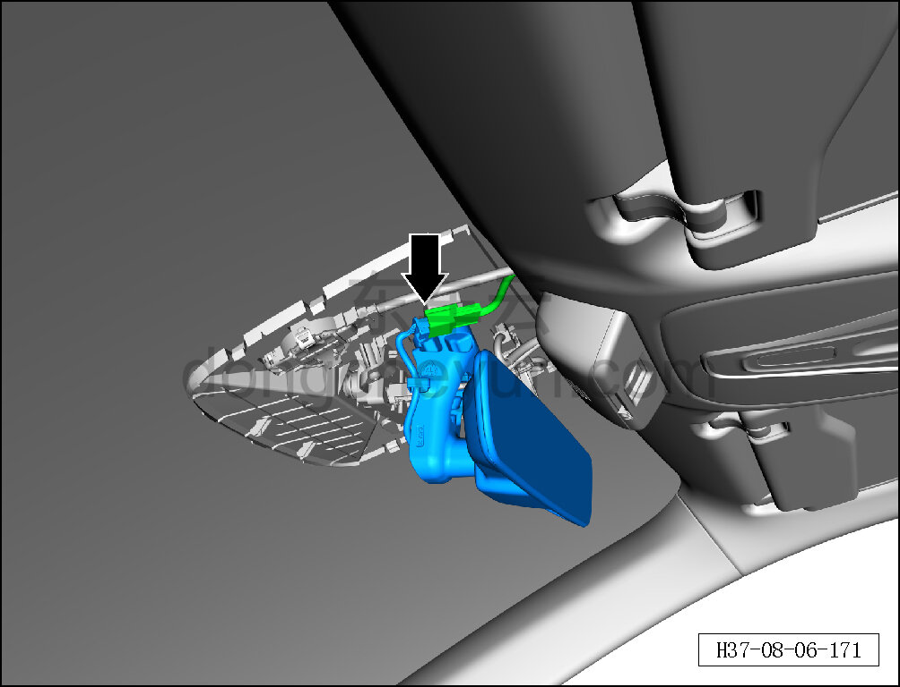
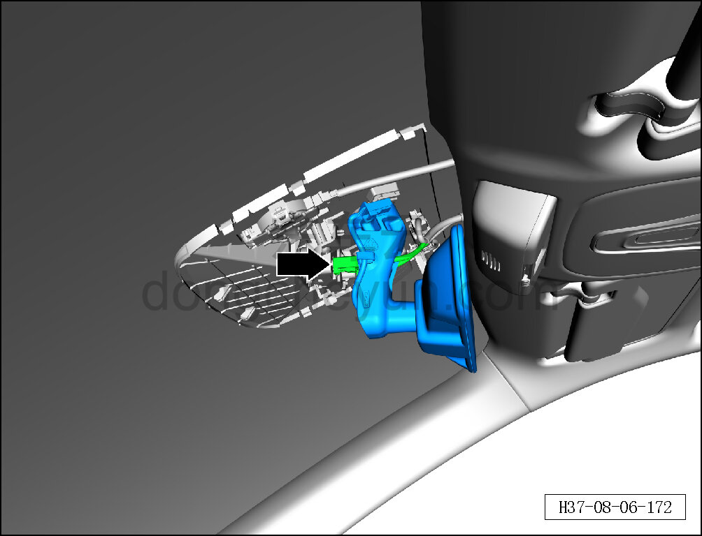
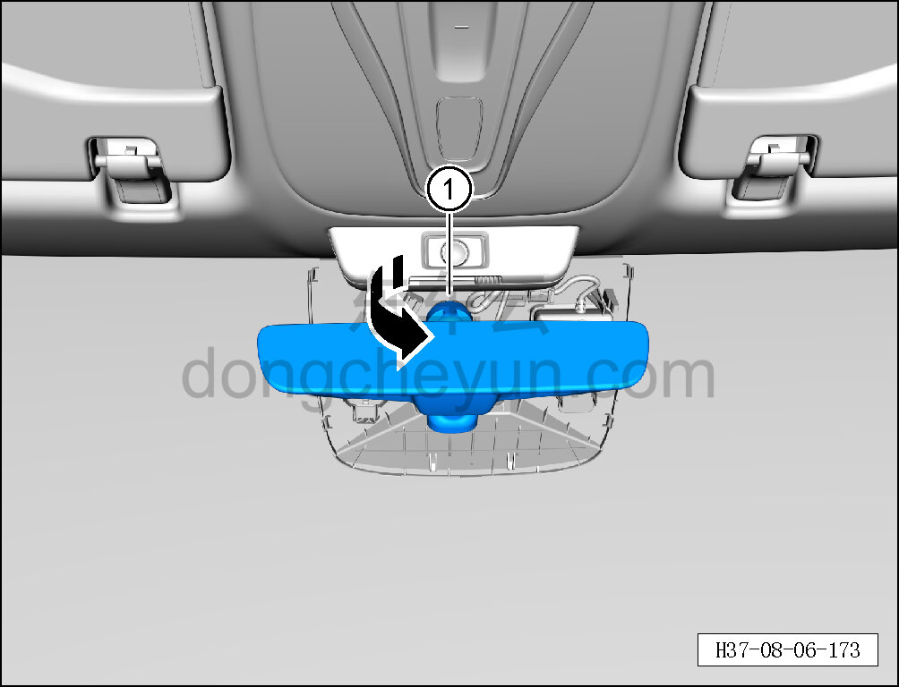

# Снятие и установка внутреннего зеркала заднего вида

> Внутренняя и внешняя отделка › Наружные элементы отделки › Система зеркал заднего вида  
> Оригинал: `拆卸与安装内后视镜` · [dongcheyun 56746](https://dongcheyun.com/p/56746), страница `4951a251a3c24236bbd9989d3ba69024` · [оглавление](../README.md)

**Порядок снятия**

1. Выключите все электроприборы, отключите питание.

2. Выполните операцию обесточивания автомобиля для ремонта. См. [3.1.4.1 Обесточивание автомобиля](../03-техническое-обслуживание/005-обесточивание-автомобиля.md)

3. Снимите передний декоративный кожух внутреннего зеркала заднего вида. См. [8.6.8.7 Снятие и установка переднего декоративного кожуха внутреннего зеркала заднего вида](260-снятие-и-установка-переднего-декоративного-кожуха.md)

4. Снимите задний декоративный кожух внутреннего зеркала заднего вида. См. [8.6.8.8 Снятие и установка заднего декоративного кожуха внутреннего зеркала заднего вида](261-снятие-и-установка-заднего-декоративного-кожуха.md)

5. Снимите внутреннее зеркало заднего вида.

a. Нажав на фиксатор разъёма, отсоедините разъём внутреннего зеркала заднего вида.

b. Нажав на фиксатор разъёма, отсоедините разъём жгута проводов кузова.

c. Повернув против часовой стрелки, отсоедините и снимите внутреннее зеркало заднего вида ①.

**Порядок установки**

Установка выполняется в обратном порядке.

**Внимание:**

**- После завершения установки проверьте нормальную работу функции регулировки внутреннего зеркала заднего вида.**

**- После завершения установки проверьте надёжность установки внутреннего зеркала заднего вида.**
