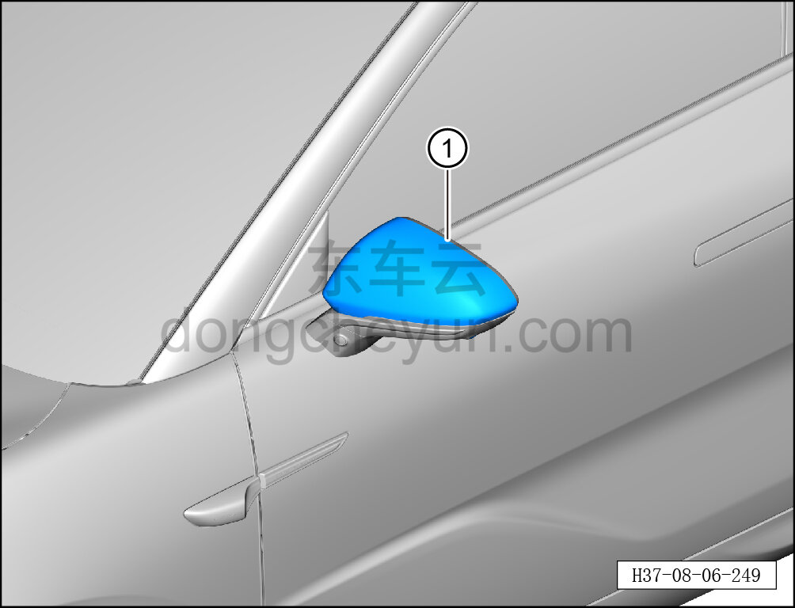

# Снятие и установка декоративного кожуха левого наружного зеркала заднего вида

> Внутренняя и внешняя отделка › Наружные элементы отделки › Система зеркал заднего вида  
> Оригинал: `拆卸与安装左外后视镜装饰罩` · [dongcheyun 56746](https://dongcheyun.com/p/56746), страница `0e5901f607f046b8a41a54f7f7ac0e35` · [оглавление](../README.md)

**Порядок снятия**

**Примечание:**

**- Далее описаны снятие и установка декоративного кожуха левого наружного зеркала заднего вида, для правой стороны действия аналогичны левой.**

1. Снимите декоративный кожух левого наружного зеркала заднего вида.

a. С помощью съёмника обивки отогните и извлеките декоративный кожух левого наружного зеркала заднего вида ①.

**Порядок установки**

Установка выполняется в обратном порядке.

**Внимание:**

**- Проверьте фиксирующие клипсы на повреждения, при необходимости замените декоративный кожух левого наружного зеркала заднего вида.**
