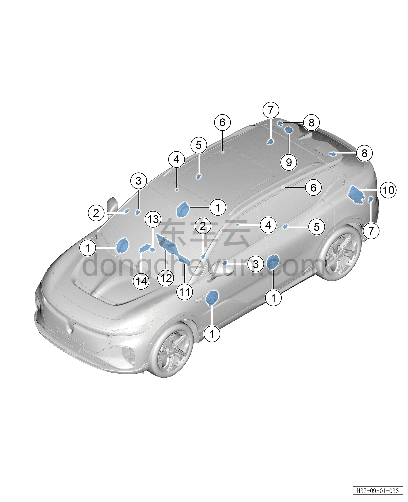

# Расположение компонентов

> Электрическая и электронная система › Система аудио- и видеоразвлечений  
> Оригинал: `部件位置图` · [dongcheyun 56746](https://dongcheyun.com/p/56746), страница `2f0388e8a2ea4e1ca89042911d895647` · [оглавление](../README.md)

| № | Наименование детали | Кол-во на автомобиль | Примечание |
|---|---|---|---|
| 1 | Низкочастотный динамик | 4 | Расположен в правой нижней части внутри обивки двери |
| 2 | Высокочастотный возбудитель стойки A | 2 | Расположен с внутренней стороны верхней накладки стойки A |
| 3 | Среднечастотный возбудитель передней двери | 2 | Расположен в верхней части внутри обивки двери |
| 4 | Среднечастотный возбудитель задней двери | 2 | Расположен в верхней части внутри обивки двери |
| 5 | Микрофон | 2 | Расположен у поручня безопасности водителя и переднего пассажира |
| 6 | Одиночный микрофон | 2 | Расположен у поручня безопасности заднего ряда сидений |
| 7 | Наружный низкочастотный возбудитель | 2 | Расположен с внутренней стороны заднего бампера |
| 8 | Высокочастотный возбудитель двери багажника | 2 | Расположен внутри спойлера |
| 9 | Встроенная антенна GNSS | 1 | Расположен внутри спойлера |
| 10 | Усилитель мощности | 1 | Расположен с внутренней стороны левой задней боковой обивки |
| 11 | Комбинация приборов | 1 | Расположена за рулевым колесом |
| 12 | Мультимедийный дисплей | 1 | Расположен в средней части панели приборов |
| 13 | Среднечастотный возбудитель панели приборов | 1 | Расположен с внутренней стороны верхней крышки панели приборов |
| 14 | Антенна 5G | 1 | Расположен с внутренней стороны верхней крышки панели приборов |
