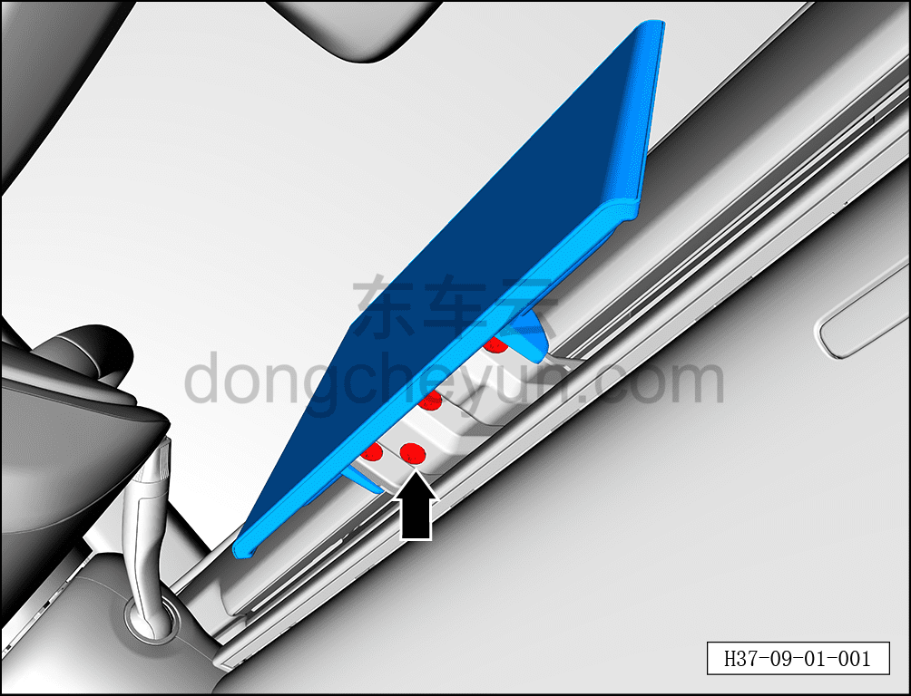
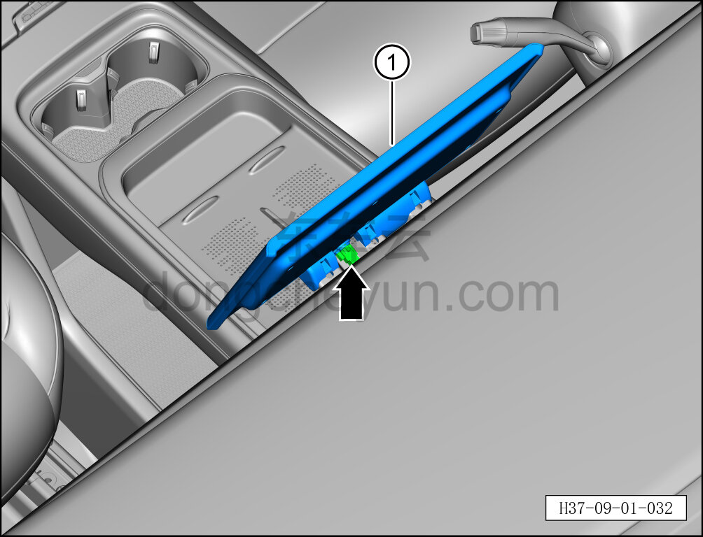

# Снятие и установка мультимедийного дисплея

> Электрическая и электронная система › Система аудио- и видеоразвлечений › Мультимедийный дисплей  
> Оригинал: `拆卸与安装多媒体显示屏` · [dongcheyun 56746](https://dongcheyun.com/p/56746), страница `155693c5ff9648a188b06b1bc25a0ab9` · [оглавление](../README.md)

**Порядок снятия**

1. Выключите все электроприборы, отключите питание.

2. Выполните операцию обесточивания автомобиля для ремонта. См. [3.1.4.1 Обесточивание автомобиля](../03-техническое-обслуживание/005-обесточивание-автомобиля.md)

3. Снимите мультимедийный дисплей.

a. С помощью биты T30 выверните 4 крепёжных болта мультимедийного дисплея.

Момент затяжки болтов: 10±1 Н·м

**Внимание:**

**- К мультимедийному дисплею с тыльной стороны подключён жгут проводов; после выворачивания болтов не тяните дисплей с усилием, чтобы не повредить жгут проводов.**

b. Нажав на фиксатор разъёма, отсоедините разъём мультимедийного дисплея.

c. Извлеките мультимедийный дисплей ①.

**Порядок установки**

Установка выполняется в обратном порядке.

**Примечание:**

**- После завершения установки проверьте нормальную работу мультимедийного дисплея.**
