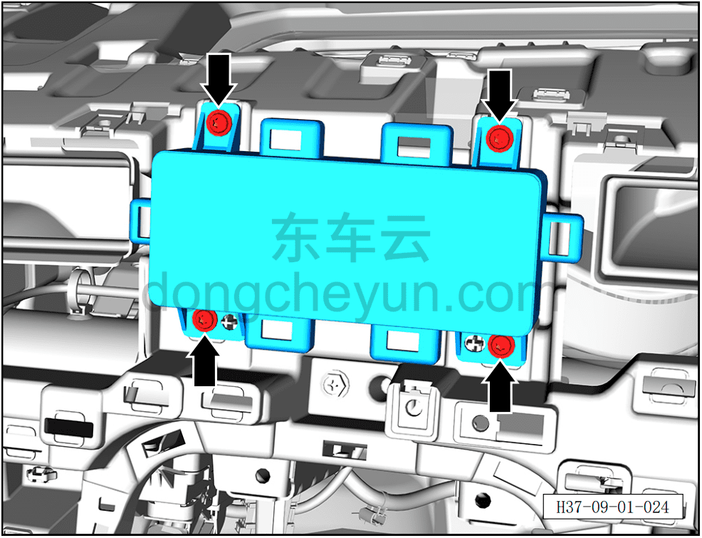
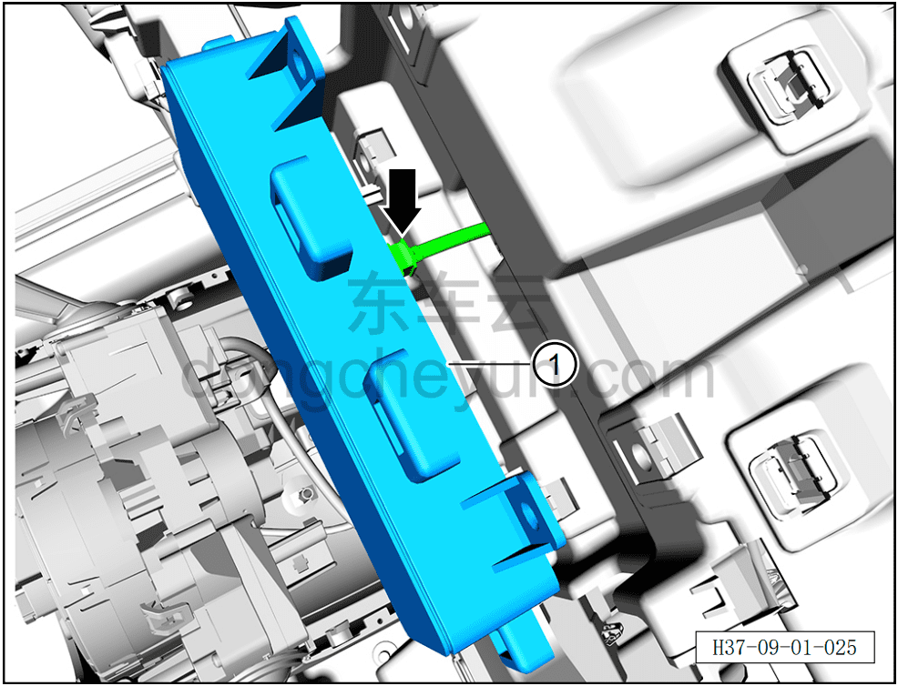

# Снятие и установка комбинации приборов

> Электрическая и электронная система › Система аудио- и видеоразвлечений › Мультимедийный дисплей  
> Оригинал: `拆卸与安装组合仪表` · [dongcheyun 56746](https://dongcheyun.com/p/56746), страница `e1ea7ba869f64c5aa476c6bd2cf5876b` · [оглавление](../README.md)

**Порядок снятия**

1. Выключите все электроприборы, отключите питание.

2. Выполните обесточивание автомобиля для ремонта. См. [3.1.4.1 Обесточивание автомобиля](../03-техническое-обслуживание/005-обесточивание-автомобиля.md)

3. Снимите дефлектор воздуховода. См. [8.2.4.12 Снятие и установка дефлектора воздуховода](../08-внутренняя-и-внешняя-отделка/065-снятие-и-установка-воздуховыпускного-отверстия.md)

4. Снимите комбинацию приборов.

a. С помощью биты T25 выверните 4 крепёжных винта комбинации приборов.

Момент затяжки винта: 1.5±0.5 Н·м

**Внимание:**

**- К комбинации приборов с тыльной стороны подключён жгут проводов; после выворачивания винтов не тяните её с усилием, чтобы не повредить жгут проводов.**

b. Нажав на фиксатор разъёма, отсоедините разъём комбинации приборов.

c. Извлеките комбинацию приборов ①.

**Порядок установки**

Установка выполняется в обратном порядке.

**Примечание:**

**- После завершения установки проверьте нормальную работу комбинации приборов.**
