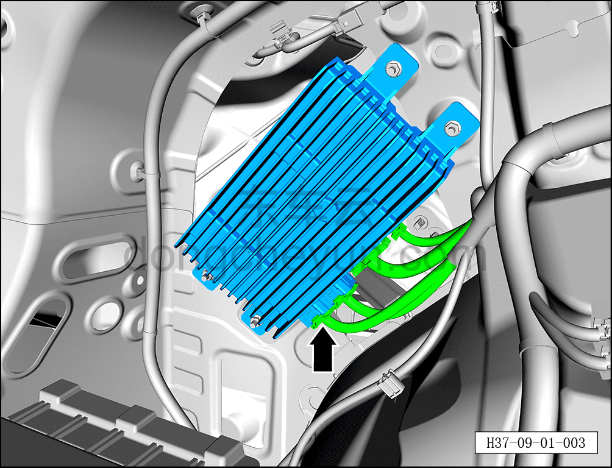
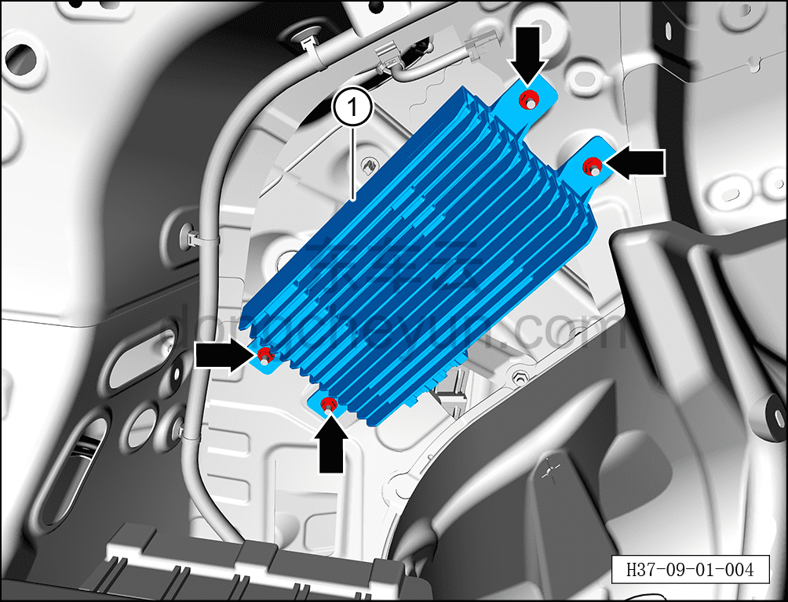

# Снятие и установка усилителя мощности

> Электрическая и электронная система › Система аудио- и видеоразвлечений › Усилитель мощности акустической системы  
> Оригинал: `拆卸与安装功率放大器` · [dongcheyun 56746](https://dongcheyun.com/p/56746), страница `46fe1bda618b4bba93214565e485b524` · [оглавление](../README.md)

**Порядок снятия**

1. Выключите все электроприборы, отключите питание.

2. Выполните операцию обесточивания автомобиля для ремонта. См. [3.1.4.1 Обесточивание автомобиля](../03-техническое-обслуживание/005-обесточивание-автомобиля.md)

3. Снимите левую заднюю боковую обивку в сборе. См. [8.5.5.6 Снятие и установка левой задней боковой обивки](../08-внутренняя-и-внешняя-отделка/136-снятие-и-установка-левой-обивки-задней-боковины.md)

4. Снимите усилитель мощности.

a. Нажав на фиксатор разъёма, отсоедините 4 разъёма усилителя мощности.

b. С помощью торцевой головки на 10 мм отверните 4 крепёжные гайки усилителя мощности.

Момент затяжки гайки: 6±1 Н·м

c. Извлеките усилитель мощности ①

**Порядок установки**

Установка выполняется в обратном порядке.

**Примечание:**

**После завершения замены необходимо выполнить следующие операции с помощью диагностического сканера или удалённой диагностики:**

**- Сначала прошить программное обеспечение до последней версии;**

**- После успешного обновления программного обеспечения выполнить процедуру замены детали для контроллера.**

**- После завершения установки проверьте нормальную работу усилителя мощности.**
