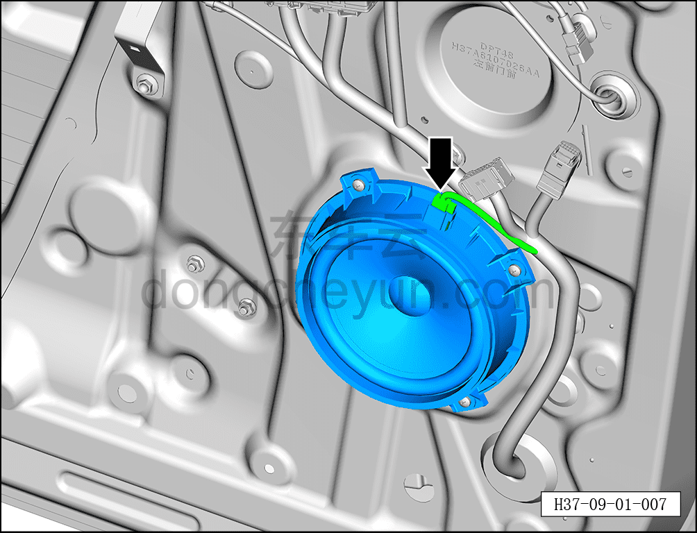
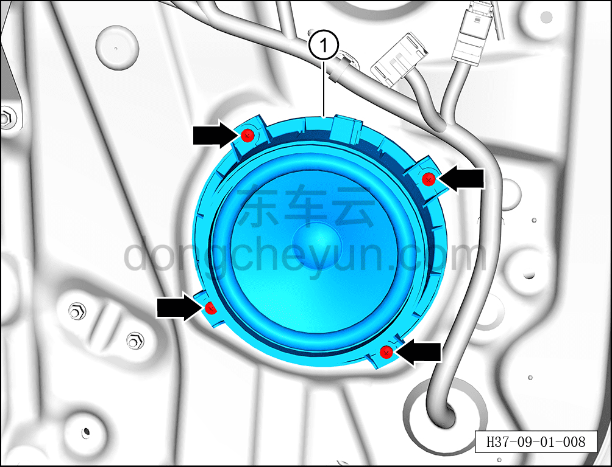

# Снятие и установка низкочастотного динамика (передняя дверь)

> Электрическая и электронная система › Система аудио- и видеоразвлечений › Динамики  
> Оригинал: `拆卸与安装低音扬声器（前门）` · [dongcheyun 56746](https://dongcheyun.com/p/56746), страница `a7f15fad8503445a8fe3c4b72fab2b1b` · [оглавление](../README.md)

**Порядок снятия**

**Примечание:**

**- Далее описаны снятие и установка низкочастотного динамика левой передней двери, для правой стороны действия аналогичны левой.**

1. Выключите все электроприборы, отключите питание.

2. Выполните обесточивание автомобиля для ремонта. См. [3.1.4.1 Обесточивание автомобиля](../03-техническое-обслуживание/005-обесточивание-автомобиля.md)

3. Снимите узел накладки левой передней двери. См. [8.4.2.1 Снятие и установка внутренней обивки левой передней двери](../08-внутренняя-и-внешняя-отделка/117-снятие-и-установка-обивки-левой-передней-двери.md)

4. Снимите низкочастотный динамик левой передней двери.

a. Нажав на фиксатор разъёма, отсоедините разъём низкочастотного динамика левой передней двери.

b. С помощью крестовой отвёртки выверните 4 крепёжных винта низкочастотного динамика левой передней двери.

Момент затяжки винта: 2±0.5 Н·м

c. Извлеките низкочастотный динамик левой передней двери ①.

**Порядок установки**

Установка выполняется в обратном порядке.

**Примечание:**

**- После завершения установки проверьте нормальную работу низкочастотного динамика.**
