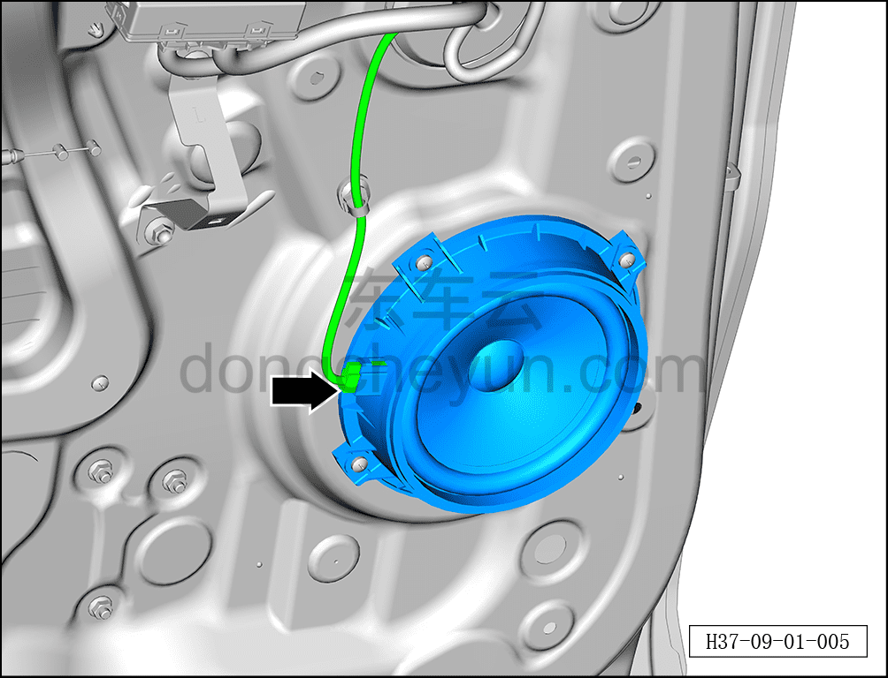
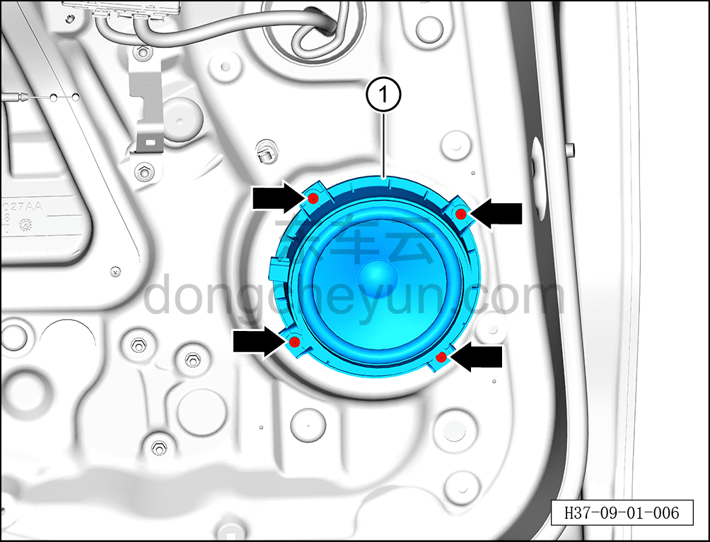

# Снятие и установка низкочастотного динамика (задняя дверь)

> Электрическая и электронная система › Система аудио- и видеоразвлечений › Динамики  
> Оригинал: `拆卸与安装低音扬声器（后门）` · [dongcheyun 56746](https://dongcheyun.com/p/56746), страница `fb97bdf131b74eae9bed8b176268cc5e` · [оглавление](../README.md)

**Порядок снятия**

**Примечание:**

**- Далее описаны снятие и установка низкочастотного динамика левой задней двери, для правой стороны действия аналогичны левой.**

1. Выключите все электроприборы, отключите питание.

2. Выполните операцию обесточивания автомобиля для ремонта. См. [3.1.4.1 Обесточивание автомобиля](../03-техническое-обслуживание/005-обесточивание-автомобиля.md)

3. Снимите узел накладки левой задней двери. См. [8.4.3.1 Снятие и установка внутренней обивки левой задней двери](../08-внутренняя-и-внешняя-отделка/119-снятие-и-установка-обивки-левой-задней-двери.md)

4. Снимите низкочастотный динамик левой задней двери.

a. Нажав на фиксатор разъёма, отсоедините разъём низкочастотного динамика левой задней двери.

b. С помощью крестовой отвёртки выверните 3 крепёжных винта низкочастотного динамика левой задней двери.

Момент затяжки винта: 1.5±0.5 Н·м

c. Извлеките низкочастотный динамик левой задней двери ①.

**Порядок установки**

Установка выполняется в обратном порядке.

**Примечание:**

**- После завершения установки проверьте нормальную работу низкочастотного динамика.**
