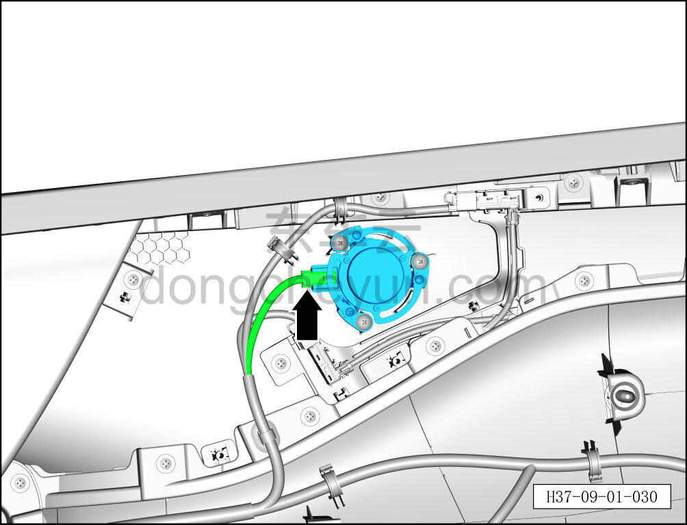
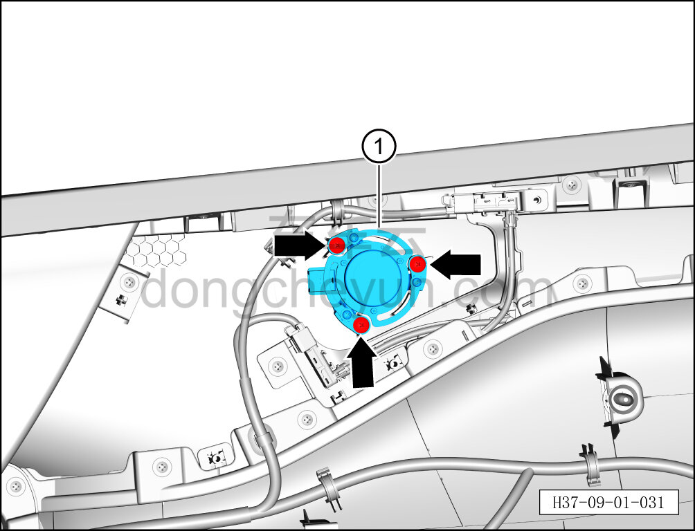

# Снятие и установка среднечастотного возбудителя (левая передняя дверь)

> Электрическая и электронная система › Система аудио- и видеоразвлечений › Динамики  
> Оригинал: `拆卸与安装（左前门）中频激励器` · [dongcheyun 56746](https://dongcheyun.com/p/56746), страница `d3879279857543ab98de31d4e2d45232` · [оглавление](../README.md)

**Порядок снятия**

**Примечание:**

**- Далее описаны снятие и установка среднечастотного возбудителя левой передней двери, для правой стороны действия аналогичны левой.**

1. Выключите все электроприборы, отключите питание.

2. Выполните обесточивание автомобиля для ремонта. См. [3.1.4.1 Обесточивание автомобиля](../03-техническое-обслуживание/005-обесточивание-автомобиля.md)

3. Снимите внутреннюю обивку левой передней двери. См. [8.4.2.1 Снятие и установка внутренней обивки левой передней двери](../08-внутренняя-и-внешняя-отделка/117-снятие-и-установка-обивки-левой-передней-двери.md)

4. Снимите среднечастотный возбудитель (левой передней двери).

a. Нажав на фиксатор разъёма, отсоедините разъём среднечастотного возбудителя левой передней двери.

b. С помощью крестовой отвёртки выверните 3 крепёжных винта среднечастотного возбудителя левой передней двери.

Момент затяжки винта: 1.5±0.5 Н·м

c. Извлеките среднечастотный возбудитель (левой передней двери) ①.

**Порядок установки**

Установка выполняется в обратном порядке.

**Примечание:**

**- После завершения установки проверьте нормальную работу среднечастотного возбудителя.**
