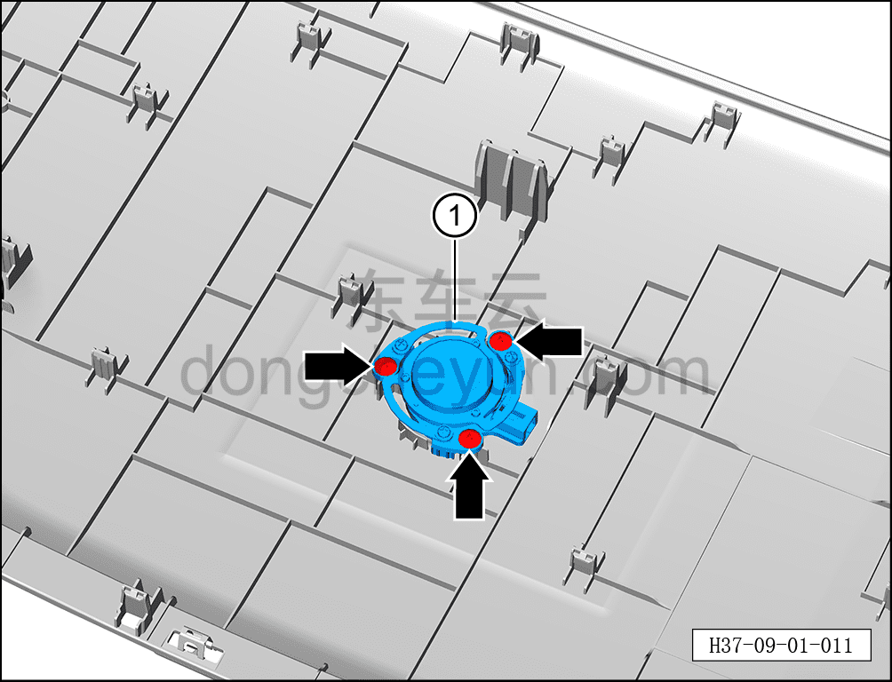

# Снятие и установка среднечастотного возбудителя (панели приборов)

> Электрическая и электронная система › Система аудио- и видеоразвлечений › Динамики  
> Оригинал: `拆卸与安装（仪表板）中频激励器` · [dongcheyun 56746](https://dongcheyun.com/p/56746), страница `130e929520db44fc91e44d5b65120d78` · [оглавление](../README.md)

**Порядок снятия**

1. Выключите все электроприборы, отключите питание.

2. Выполните операцию обесточивания автомобиля для ремонта. См. [3.1.4.1 Обесточивание автомобиля](../03-техническое-обслуживание/005-обесточивание-автомобиля.md)

3. Снимите верхнюю крышку панели приборов. См. [8.2.4.10 Снятие и установка верхней крышки панели приборов](../08-внутренняя-и-внешняя-отделка/063-снятие-и-установка-верхней-крышки-панели-приборов.md)

4. Снимите среднечастотный возбудитель панели приборов.

a. С помощью крестовой отвёртки выверните 3 крепёжных винта среднечастотного возбудителя панели приборов.

Момент затяжки винта: 1.5±0.5 Н·м

b. Извлеките среднечастотный возбудитель панели приборов ①.

**Порядок установки**

Установка выполняется в обратном порядке.

**Примечание:**

**- После завершения установки проверьте нормальную работу среднечастотного возбудителя.**
