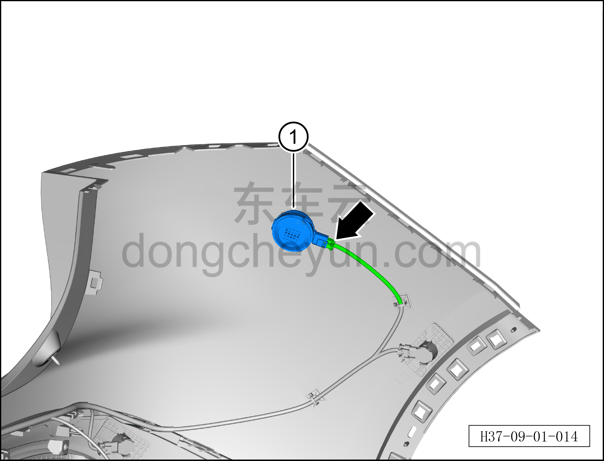

# Снятие и установка наружного низкочастотного возбудителя

> Электрическая и электронная система › Система аудио- и видеоразвлечений › Динамики  
> Оригинал: `拆卸与安装外部低频激励器` · [dongcheyun 56746](https://dongcheyun.com/p/56746), страница `fd4e5d7b553a48b4a4137c8f123373f0` · [оглавление](../README.md)

**Порядок снятия**

**Примечание:**

**- Далее описаны снятие и установка наружного низкочастотного возбудителя, для правой стороны действия аналогичны левой.**

1. Выключите все электроприборы, отключите питание.

2. Выполните операцию обесточивания автомобиля для ремонта. См. [3.1.4.1 Обесточивание автомобиля](../03-техническое-обслуживание/005-обесточивание-автомобиля.md)

3. Снимите задний бампер в сборе. См. [8.6.3.26 Снятие и установка заднего бампера в сборе](../08-внутренняя-и-внешняя-отделка/186-снятие-и-установка-заднего-бампера-в-сборе.md)

4. Снимите наружный низкочастотный возбудитель.

a. Нажав на фиксатор разъёма, отсоедините разъём наружного низкочастотного возбудителя.

b. Извлеките наружный низкочастотный возбудитель ①.

**Порядок установки**

Установка выполняется в обратном порядке.

**Примечание:**

**- После завершения установки проверьте нормальную работу низкочастотного возбудителя.**
