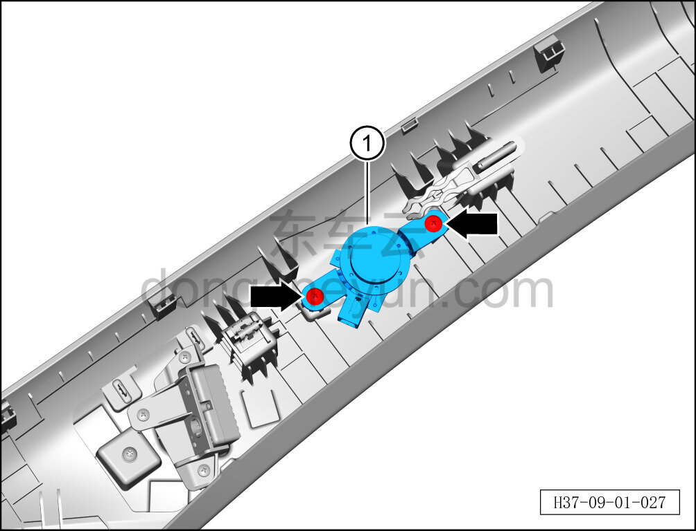

# Снятие и установка высокочастотного возбудителя (стойка A)

> Электрическая и электронная система › Система аудио- и видеоразвлечений › Динамики  
> Оригинал: `拆卸与安装高频激励器（A柱）` · [dongcheyun 56746](https://dongcheyun.com/p/56746), страница `430bd83a146846cc9e5897941865fbf6` · [оглавление](../README.md)

**Порядок снятия**

**Примечание:**

**- Далее описаны снятие и установка высокочастотного возбудителя левой стойки A, для правой стороны действия аналогичны левой.**

1. Выключите все электроприборы, отключите питание.

2. Выполните обесточивание автомобиля для ремонта. См. [3.1.4.1 Обесточивание автомобиля](../03-техническое-обслуживание/005-обесточивание-автомобиля.md)

3. Снимите верхнюю накладку левой стойки A. См. [8.5.5.1 Снятие и установка верхней накладки левой стойки A](../08-внутренняя-и-внешняя-отделка/131-снятие-и-установка-левой-верхней-накладки-стойки-a.md)

4. Снимите высокочастотный возбудитель (стойки A).

a. С помощью крестовой отвёртки выверните 2 крепёжных винта высокочастотного возбудителя (стойки A).

Момент затяжки винта: 1±0,5 Н·м

b. Извлеките высокочастотный возбудитель (стойки A) ①.

**Порядок установки**

Установка выполняется в обратном порядке.

**Примечание:**

**- После завершения установки проверьте нормальную работу низкочастотного возбудителя.**
