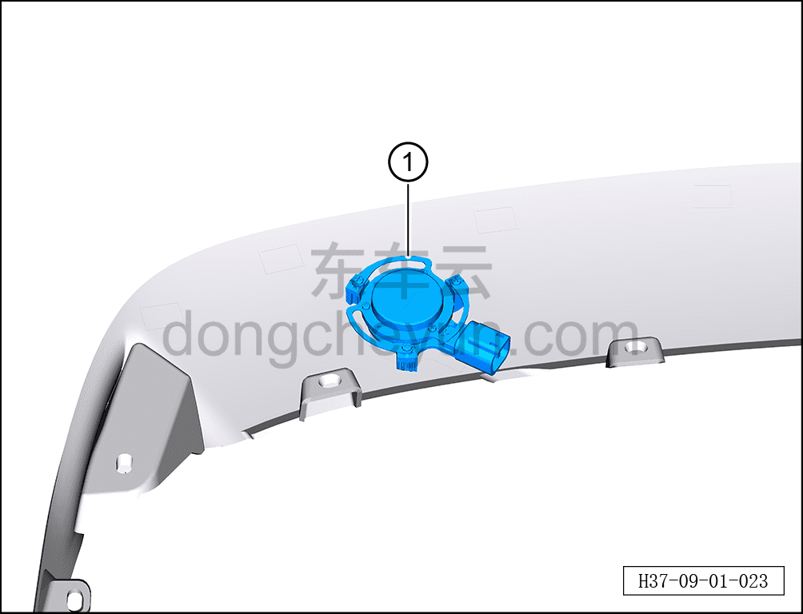

# Снятие и установка высокочастотного возбудителя двери багажника

> Электрическая и электронная система › Система аудио- и видеоразвлечений › Динамики  
> Оригинал: `拆卸与安装尾门高频激励器` · [dongcheyun 56746](https://dongcheyun.com/p/56746), страница `9ce3ff1a957747adb7fdea378e9ea679` · [оглавление](../README.md)

**Порядок снятия**

**Примечание:**

**- Далее описаны снятие и установка правого высокочастотного возбудителя двери багажника, для левой стороны действия аналогичны правой.**

1. Выключите все электроприборы, отключите питание.

2. Выполните обесточивание автомобиля для ремонта. См. [3.1.4.1 Обесточивание автомобиля](../03-техническое-обслуживание/005-обесточивание-автомобиля.md)

3. Снимите спойлер. См. [8.6.6.8 Снятие и установка спойлера](../08-внутренняя-и-внешняя-отделка/221-снятие-и-установка-спойлера.md)

4. Снимите высокочастотный возбудитель двери багажника.

a. Нажав на фиксатор разъёма, отсоедините разъём высокочастотного возбудителя двери багажника.

b. С помощью крестовой отвёртки выверните 6 крепёжных винтов правой внутренней панели заднего спойлера.

c. Извлеките высокочастотный возбудитель двери багажника ①.

**Порядок установки**

Установка выполняется в обратном порядке.

**Примечание:**

**- После завершения установки проверьте нормальную работу высокочастотного возбудителя.**
