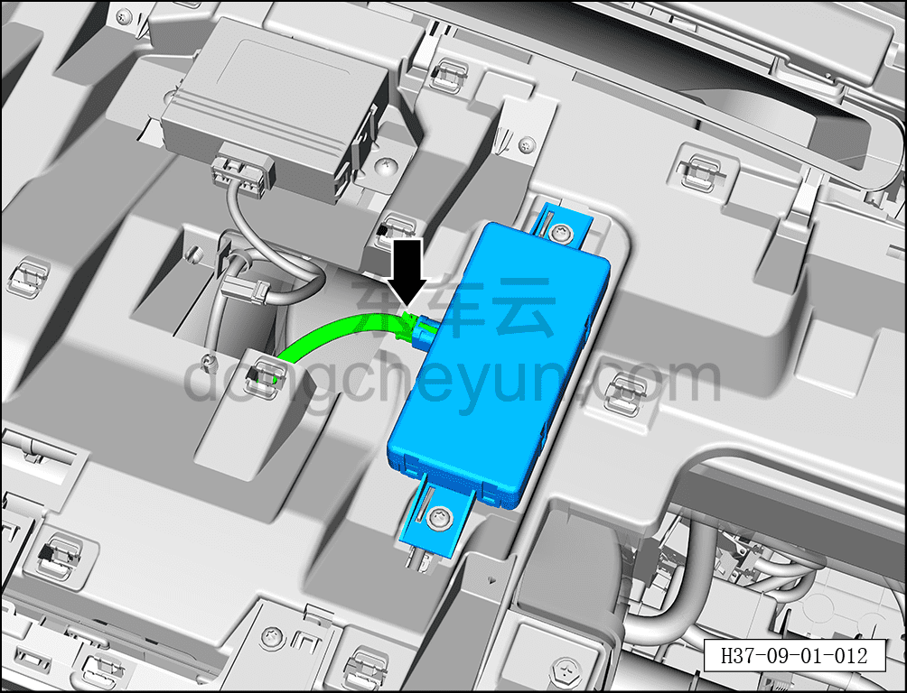
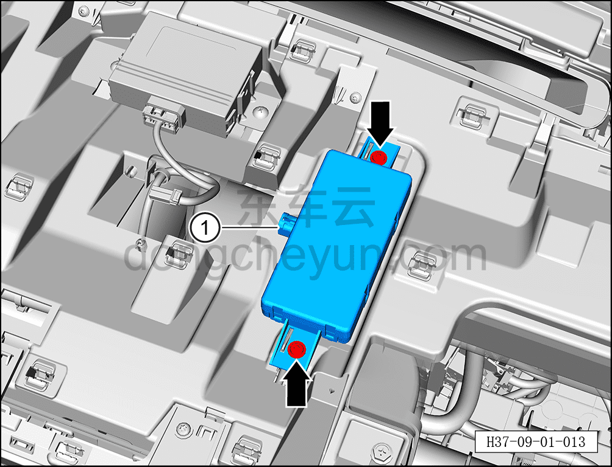

# Снятие и установка антенны 5G

> Электрическая и электронная система › Система аудио- и видеоразвлечений › Антенны  
> Оригинал: `拆卸与安装5G天线` · [dongcheyun 56746](https://dongcheyun.com/p/56746), страница `f0e65f82dbeb4631997f95f19d149300` · [оглавление](../README.md)

**Порядок снятия**

1. Выключите все электроприборы, отключите питание.

2. Выполните операцию обесточивания автомобиля для ремонта. См. [3.1.4.1 Обесточивание автомобиля](../03-техническое-обслуживание/005-обесточивание-автомобиля.md)

3. Снимите верхнюю крышку панели приборов. См. [8.2.4.10 Снятие и установка верхней крышки панели приборов](../08-внутренняя-и-внешняя-отделка/063-снятие-и-установка-верхней-крышки-панели-приборов.md)

4. Снимите антенну 5G.

a. Нажав на фиксатор разъёма, отсоедините разъём антенны 5G.

b. С помощью биты T25 выверните 2 крепёжных винта антенны 5G.

Момент затяжки винта: 1.5±0.5 Н·м

c. Извлеките антенну 5G ①.

**Порядок установки**

Установка выполняется в обратном порядке.

**Примечание:**

**- После завершения установки через мультимедийный дисплей проверьте нормальный уровень сигнала антенны 5G.**
