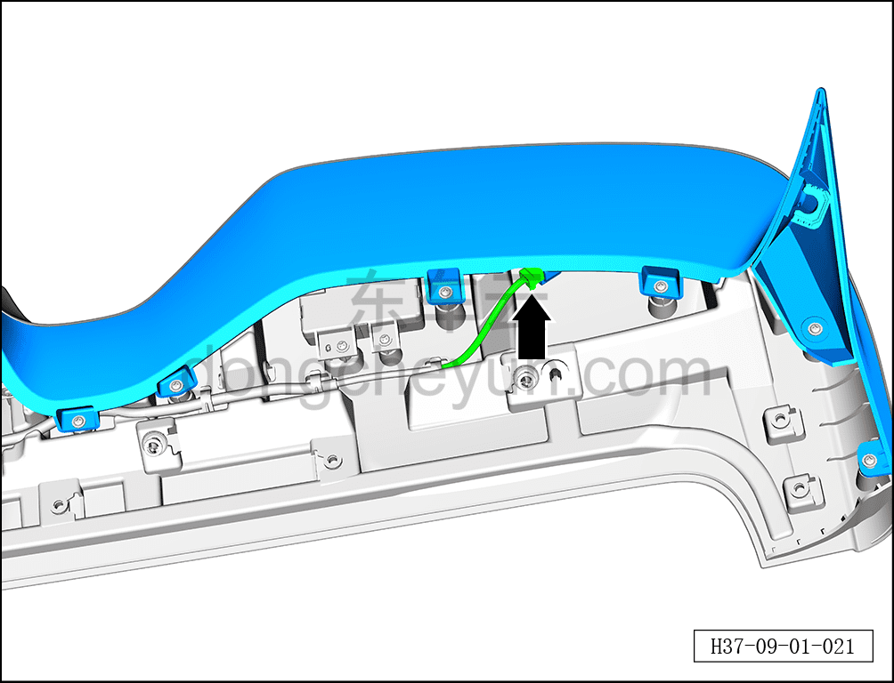
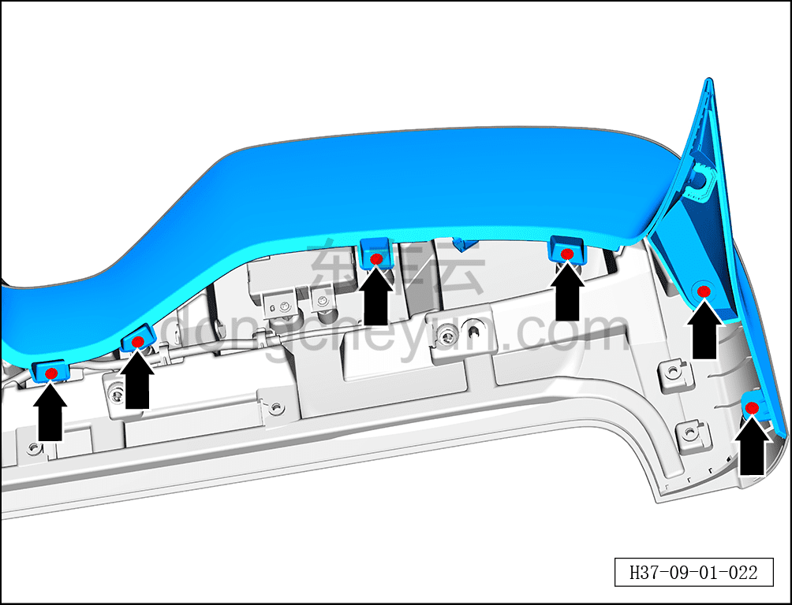
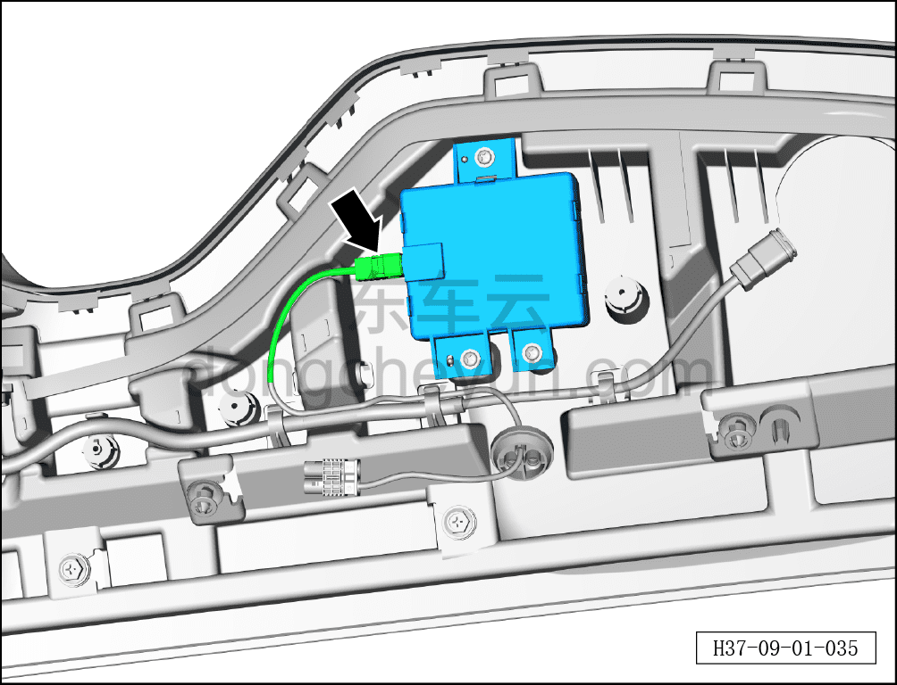
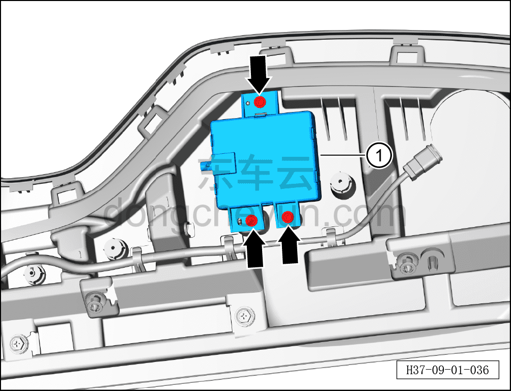

# Снятие и установка встроенной антенны GNSS

> Электрическая и электронная система › Система аудио- и видеоразвлечений › Антенны  
> Оригинал: `拆卸与安装内置GNSS 天线` · [dongcheyun 56746](https://dongcheyun.com/p/56746), страница `fb3dfb4b1c7841c2a0c0dff6cdecf712` · [оглавление](../README.md)

**Порядок снятия**

1. Выключите все электроприборы, отключите питание.

2. Выполните операцию обесточивания автомобиля для ремонта. См. [3.1.4.1 Обесточивание автомобиля](../03-техническое-обслуживание/005-обесточивание-автомобиля.md)

3. Снимите спойлер. См. [8.6.6.8 Снятие и установка спойлера](../08-внутренняя-и-внешняя-отделка/221-снятие-и-установка-спойлера.md)

4. Снимите встроенную антенну GNSS.

a. Нажав на фиксатор разъёма, отсоедините разъём высокочастотного возбудителя двери багажника.

b. С помощью крестовой отвёртки выверните 6 крепёжных винтов правой внутренней панели заднего спойлера.

c. Нажав на фиксатор разъёма, отсоедините разъём встроенной антенны GNSS.

d. С помощью крестовой отвёртки выверните 3 крепёжных винта встроенной антенны GNSS.

e. Извлеките встроенную антенну GNSS ①.

**Порядок установки**

Установка выполняется в обратном порядке.

**Примечание:**

**- После завершения установки проверьте нормальную работу встроенной антенны GNSS.**
