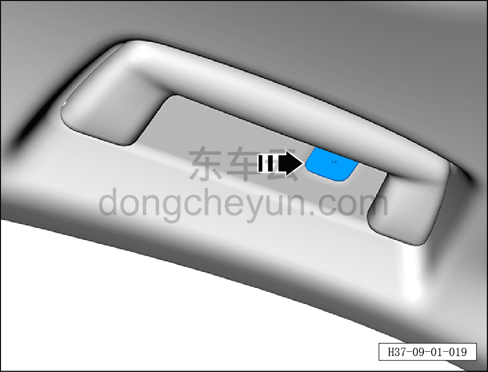
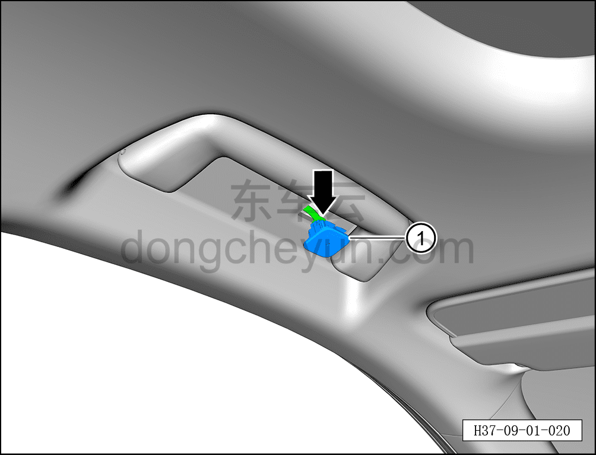

# Снятие и установка микрофона

> Электрическая и электронная система › Система аудио- и видеоразвлечений › Микрофон  
> Оригинал: `拆卸与安装麦克风` · [dongcheyun 56746](https://dongcheyun.com/p/56746), страница `b16ed4dc680c4b7798fc1f78e4e5287b` · [оглавление](../README.md)

**Порядок снятия**

**Примечание:**

**- Далее описаны снятие и установка левого микрофона, для правой стороны действия аналогичны левой.**

1. Выключите все электроприборы, отключите питание.

2. Выполните операцию обесточивания автомобиля для ремонта. См. [3.1.4.1 Обесточивание автомобиля](../03-техническое-обслуживание/005-обесточивание-автомобиля.md)

3. Снимите левый микрофон.

a. С помощью съёмника обивки снимите левый микрофон, двигаясь по направлению стрелки.

**Внимание:**

**- К микрофону с тыльной стороны подключён жгут проводов; после снятия не тяните его с усилием, чтобы не повредить жгут проводов.**

b. Нажав на фиксатор разъёма, отсоедините разъём левого микрофона.

c. Извлеките левый микрофон ①.

**Порядок установки**

Установка выполняется в обратном порядке.

**Примечание:**

**- При установке сторона с клипсой должна быть обращена вперёд**

**- После завершения установки проверьте нормальную работу микрофона.**
