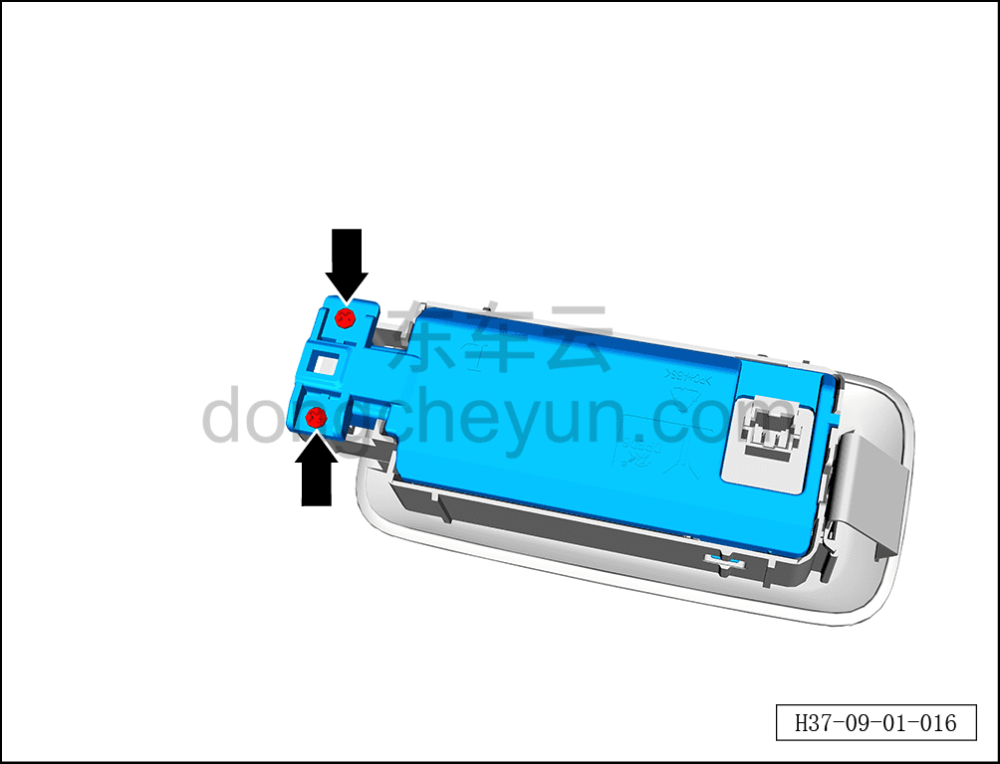
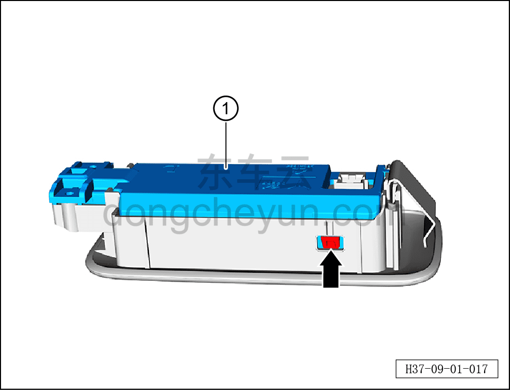
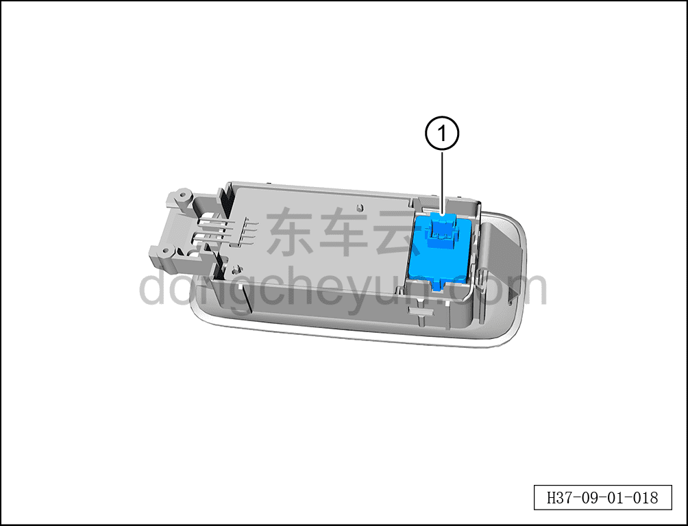

# Снятие и установка одиночного микрофона

> Электрическая и электронная система › Система аудио- и видеоразвлечений › Микрофон  
> Оригинал: `拆卸与安装单麦克风` · [dongcheyun 56746](https://dongcheyun.com/p/56746), страница `7861098eea3c47bf8ad6e7af1bd8e2e8` · [оглавление](../README.md)

**Порядок снятия**

**Примечание:**

**- Одиночный микрофон расположен внутри левого заднего потолочного светильника**

**- Далее описаны снятие и установка левого одиночного микрофона, для правой стороны действия аналогичны левой**

1. Выключите все электроприборы, отключите питание.

2. Выполните обесточивание автомобиля для ремонта. См. [3.1.4.1 Обесточивание автомобиля](../03-техническое-обслуживание/005-обесточивание-автомобиля.md)

3. Снимите левый задний потолочный светильник. См. [9.9.10.3 Снятие и установка левого заднего потолочного светильника](092-снятие-и-установка-левого-заднего-потолочного.md)

4. Снимите одиночный микрофон.

a. С помощью крестовой отвёртки выверните 2 винта крышки левого заднего потолочного светильника.

b. Отсоедините 2 клипсы крышки левого заднего потолочного светильника.

c. Извлеките крышку левого заднего потолочного светильника ①.

d. Извлеките левый одиночный микрофон ①.

**Порядок установки**

Установка выполняется в обратном порядке.

**Примечание:**

**- После завершения установки проверьте нормальную работу микрофона.**
