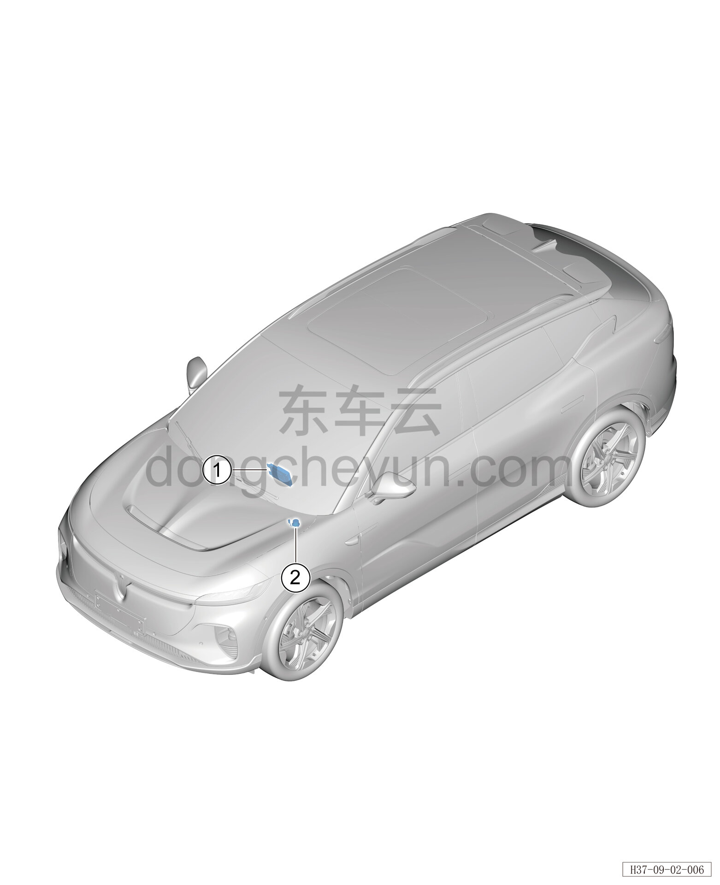

# Расположение компонентов

> Электрическая и электронная система › T-BOX  
> Оригинал: `部件位置图` · [dongcheyun 56746](https://dongcheyun.com/p/56746), страница `50592cc590a54b3184d5f50b07345dcd` · [оглавление](../README.md)

| № | Наименование детали | Кол-во на автомобиль | Примечание |
|---|---|---|---|
| 1 | T-BOX | 1 | Расположен с внутренней стороны в средней части панели приборов |
| 2 | Динамик E-CALL | 1 | Расположен с внутренней стороны левой нижней панели пола под панелью приборов |
