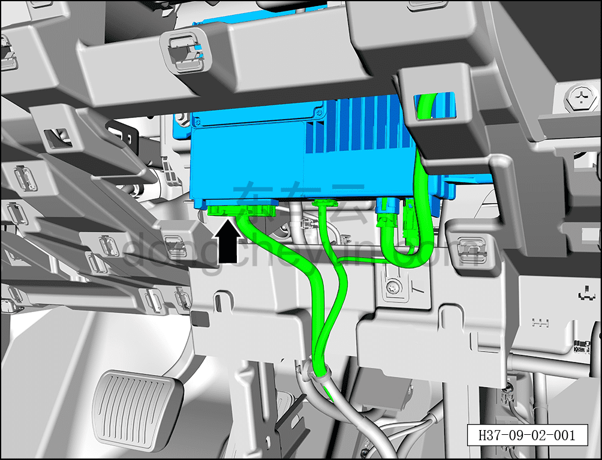
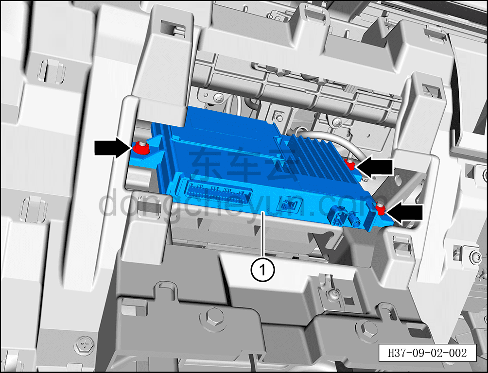

# Снятие и установка T-BOX

> Электрическая и электронная система › T-BOX › Блок управления T-BOX  
> Оригинал: `拆卸与安装T-BOX` · [dongcheyun 56746](https://dongcheyun.com/p/56746), страница `ee24c84e70084ef8805d202891158f5f` · [оглавление](../README.md)

**Порядок снятия**

1. Выключите все электроприборы, отключите питание.

2. Выполните операцию обесточивания автомобиля для ремонта. См. [3.1.4.1 Обесточивание автомобиля](../03-техническое-обслуживание/005-обесточивание-автомобиля.md)

3. Снимите среднюю правую защитную накладку. См. [8.2.4.21 Снятие и установка средней правой защитной накладки](../08-внутренняя-и-внешняя-отделка/074-снятие-и-установка-центрально-правой-накладки.md)

4. Снимите T-BOX.

a. Нажав на фиксатор разъёма, отсоедините 4 разъёма T-BOX.

b. С помощью торцевой головки на 10 мм отверните 3 крепёжные гайки T-BOX.

Момент затяжки гайки: 8±1 Н·м

c. Извлеките T-BOX ①.

**Порядок установки**

Установка выполняется в обратном порядке.

**Примечание:**

**После завершения замены необходимо выполнить следующие операции с помощью диагностического сканера или удалённой диагностики:**

**- Сначала прошить программное обеспечение до последней версии;**

**- После успешного обновления программного обеспечения выполнить процедуру замены детали для контроллера.**

**- После завершения замены сообщите на приёмку, чтобы отвязать старый ICCID от идентификации по реальному имени и провести идентификацию по реальному имени для нового ICCID.**

**- После завершения установки проверьте нормальную работу T-BOX.**
