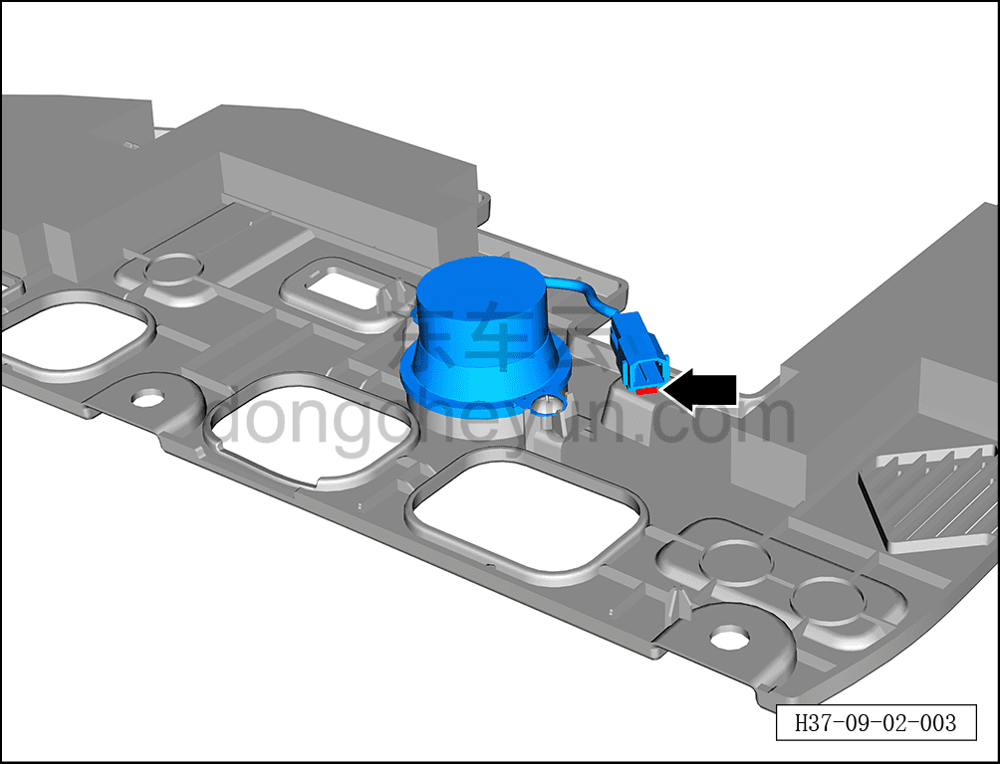
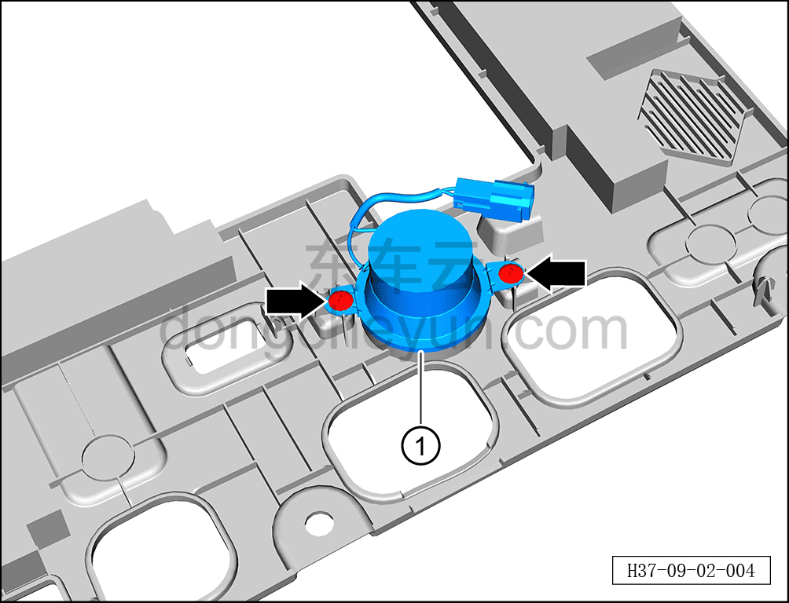

# Снятие и установка динамика E-CALL

> Электрическая и электронная система › T-BOX › Блок управления T-BOX  
> Оригинал: `拆卸与安装ECALL扬声器` · [dongcheyun 56746](https://dongcheyun.com/p/56746), страница `0ba3fcc29f9045debbe5404f7b1df42e` · [оглавление](../README.md)

**Порядок снятия**

1. Выключите все электроприборы, отключите питание.

2. Выполните обесточивание автомобиля для ремонта. [3.1.4.1 Обесточивание автомобиля](../03-техническое-обслуживание/005-обесточивание-автомобиля.md)

3. Снимите левую нижнюю панель пола под панелью приборов. [8.2.4.3 Снятие и установка левой нижней панели пола под панелью приборов](../08-внутренняя-и-внешняя-отделка/056-снятие-и-установка-левой-нижней-панели-панели-приборов.md)

4. Снимите динамик E-CALL.

a. С помощью съёмника обивки отсоедините клипсу динамика E-CALL.

b. С помощью крестовой отвёртки выверните 2 крепёжных винта динамика E-CALL.

Момент затяжки винта: 1±0,5 Н·м

c. Извлеките динамик E-CALL ①.

**Порядок установки**

Установка выполняется в обратном порядке.

**Примечание:**

**- После завершения установки проверьте нормальную работу динамика E-CALL.**
