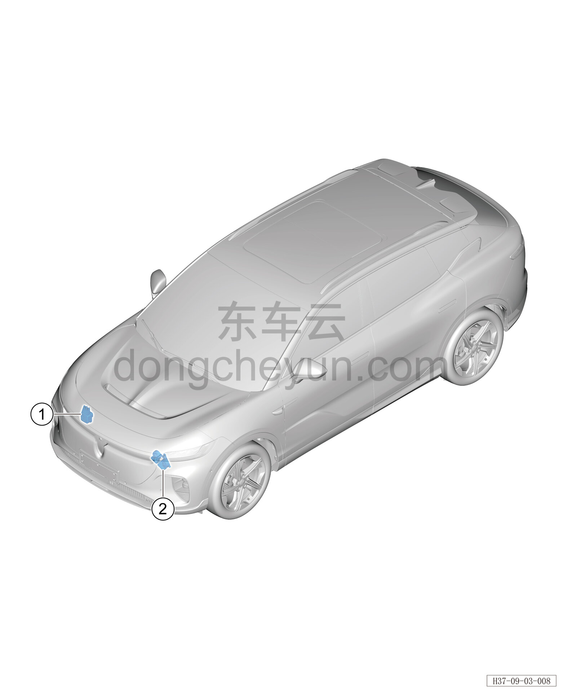

# Расположение компонентов

> Электрическая и электронная система › Система звуковой сигнализации  
> Оригинал: `部件位置图` · [dongcheyun 56746](https://dongcheyun.com/p/56746), страница `f1180a020a05453cb0093cc7af80b22a` · [оглавление](../README.md)

| № | Наименование детали | Кол-во на автомобиль | Примечание |
|---|---|---|---|
| 1 | Узел высокотонального звукового сигнала | 1 | Расположен с внутренней левой стороны переднего бампера |
| 2 | Контроллер звукового оповещения пешеходов | 1 | Расположен с внутренней правой стороны переднего бампера |
