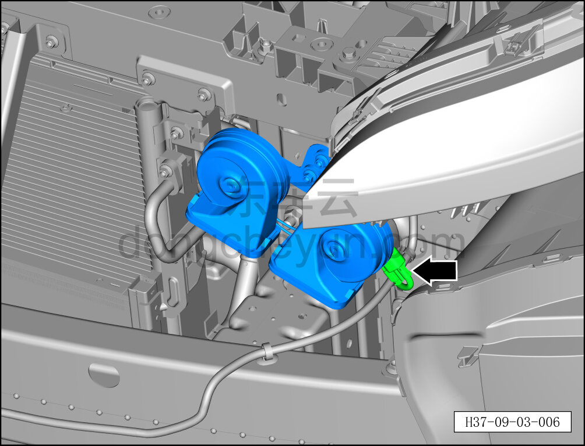
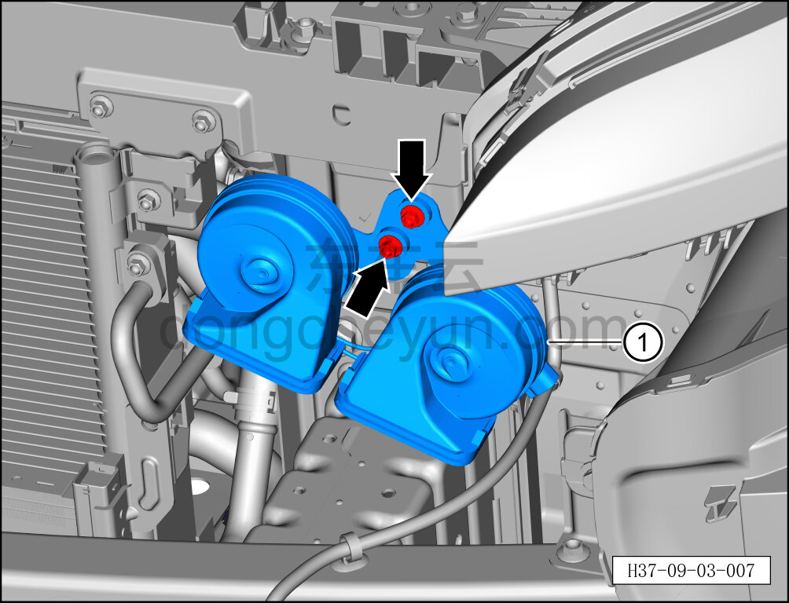

# Снятие и установка узла высоко- и низкотональных звуковых сигналов

> Электрическая и электронная система › Система звуковой сигнализации › Звуковой сигнал  
> Оригинал: `拆卸与安装高低音喇叭合件` · [dongcheyun 56746](https://dongcheyun.com/p/56746), страница `24344f9c4a464b2dad4d00c9bdcfc85c` · [оглавление](../README.md)

**Порядок снятия**

1. Выключите все электроприборы, отключите питание.

2. Выполните операцию обесточивания автомобиля для ремонта. См. [3.1.4.1 Обесточивание автомобиля](../03-техническое-обслуживание/005-обесточивание-автомобиля.md)

3. Снимите передний бампер в сборе. См. [8.6.3.3 Снятие и установка переднего бампера в сборе](../08-внутренняя-и-внешняя-отделка/163-снятие-и-установка-переднего-бампера-в-сборе.md)

4. Снимите узел высоко- и низкотональных звуковых сигналов.

a. Нажав на фиксатор разъёма, отсоедините разъём узла высоко- и низкотональных звуковых сигналов.

b. С помощью торцевой головки на 8 мм выверните 2 крепёжных болта узла высоко- и низкотональных звуковых сигналов.

Момент затяжки болтов: 10±1 Н·м

c. Извлеките узел высоко- и низкотональных звуковых сигналов ①.

**Порядок установки**

Установка выполняется в обратном порядке.

**Примечание:**

**- После завершения установки проверьте нормальную работу высоко- и низкотональных звуковых сигналов.**
