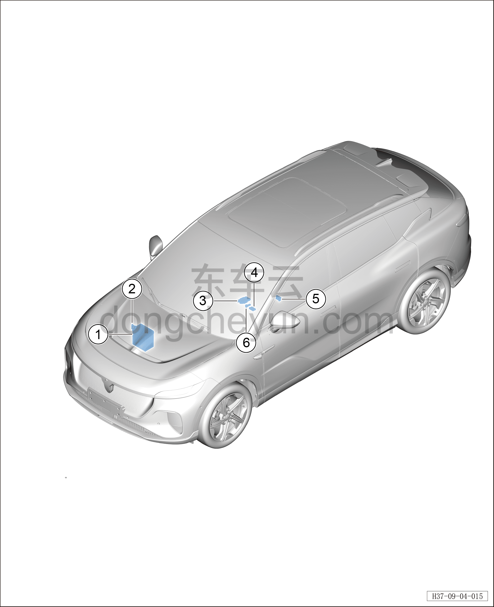

# Расположение компонентов

> Электрическая и электронная система › Система низковольтного электропитания  
> Оригинал: `部件位置图` · [dongcheyun 56746](https://dongcheyun.com/p/56746), страница `6656a3cec6f64d2eb0e476cf43c9b03c` · [оглавление](../README.md)

| № | Наименование детали | Кол-во на автомобиль | Примечание |
|---|---|---|---|
| 1 | Аккумуляторная батарея 12 В в сборе | 1 | Расположена с правой стороны моторного отсека |
| 2 | Датчик аккумуляторной батареи 12 В | 1 | Расположен на минусовой клемме аккумуляторной батареи 12 В |
| 3 | Контроллер беспроводной зарядки телефона | 1 | Расположен с внутренней стороны верхней панели центральной консоли |
| 4 | USB-зарядное устройство (с передачей данных) | 1 | Расположено на крышке USB центральной консоли |
| 5 | USB-зарядное устройство | 1 | Расположено на задней крышке центральной консоли |
| 6 | Розетка питания 12 В центральной консоли |   | Расположено на крышке USB центральной консоли |
