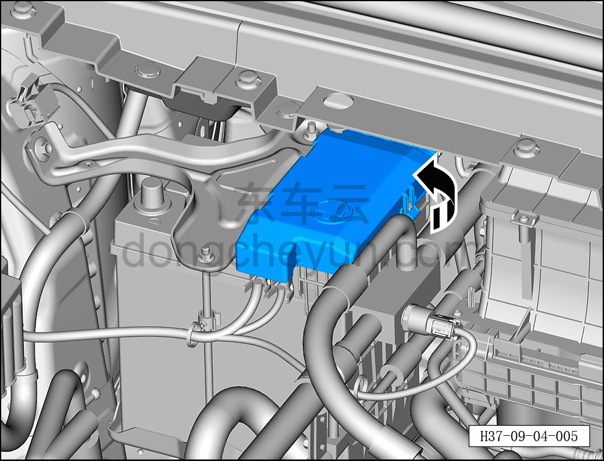
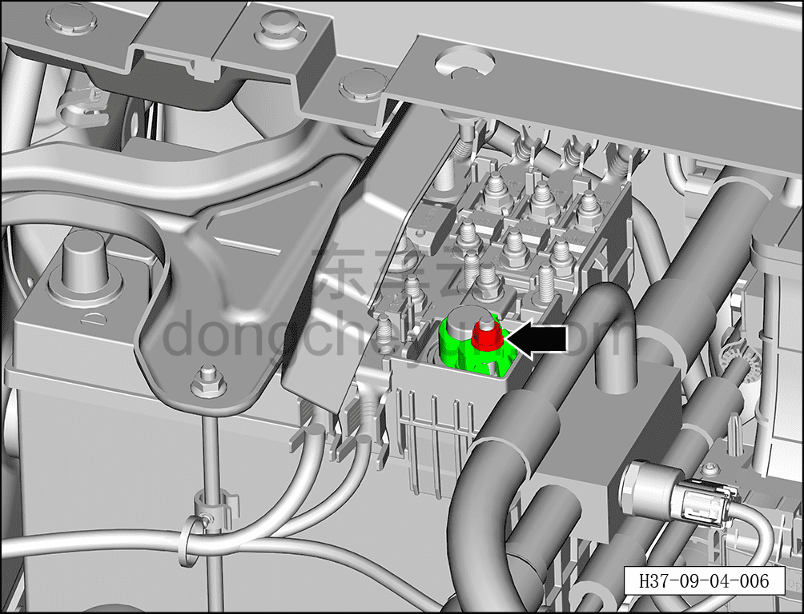
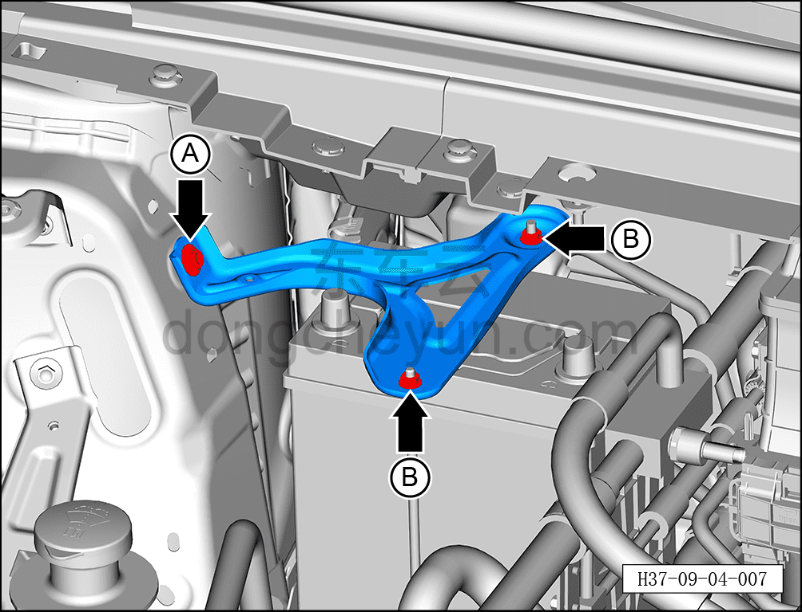
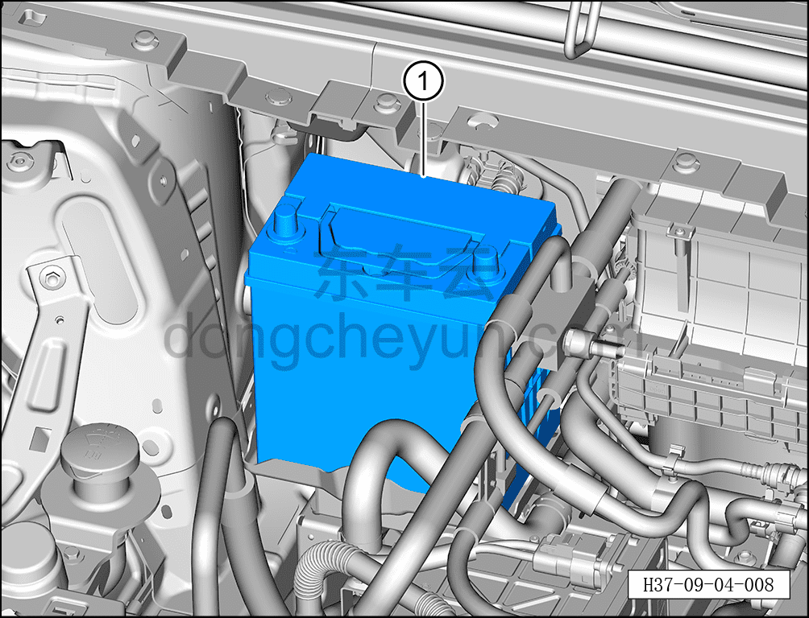

# Снятие и установка аккумуляторной батареи 12 В

> Электрическая и электронная система › Система низковольтного электропитания › Аккумуляторная батарея 12 В и её принадлежности  
> Оригинал: `拆卸与安装蓄电池` · [dongcheyun 56746](https://dongcheyun.com/p/56746), страница `d5ec26c5e4394e1a9057f2adbdf0bb28` · [оглавление](../README.md)

**Порядок снятия**

1. Выключите все электроприборы, отключите питание.

2. Выполните обесточивание автомобиля для ремонта. См. [3.1.4.1 Обесточивание автомобиля](../03-техническое-обслуживание/005-обесточивание-автомобиля.md)

3. Снимите аккумуляторную батарею 12 В.

a. Откройте защитный колпачок плюсовой клеммы аккумуляторной батареи 12 В в направлении стрелки.

b. С помощью торцевой головки на 10 мм отверните крепёжную гайку плюсового кабеля аккумуляторной батареи 12 В, отсоедините плюсовой кабель аккумуляторной батареи 12 В.

Момент затяжки гайки: 8±1 Н·м

c. С помощью торцевой головки на 13 мм выверните крепёжный болт A монтажного кронштейна аккумуляторной батареи 12 В.

Момент затяжки болтов: 10±1 Н·м

d. С помощью торцевой головки на 10 мм отверните 2 крепёжные гайки B стяжного ремня аккумуляторной батареи 12 В, извлеките монтажный кронштейн аккумуляторной батареи 12 В.

Момент затяжки гайки: 10±1 Н·м

e. Снимите аккумуляторную батарею 12 В ①.

**Порядок установки**

Установка выполняется в обратном порядке.

**Примечание:**

**- В процессе снятия и установки аккумуляторной батареи 12 В не допускайте плохого контакта на плюсовой и минусовой клеммах, иначе может возникнуть искра и привести к пожару.**

**- После завершения замены аккумуляторной батареи 12 В подключите диагностический сканер и проверьте все блоки управления на наличие кодов неисправностей.**
