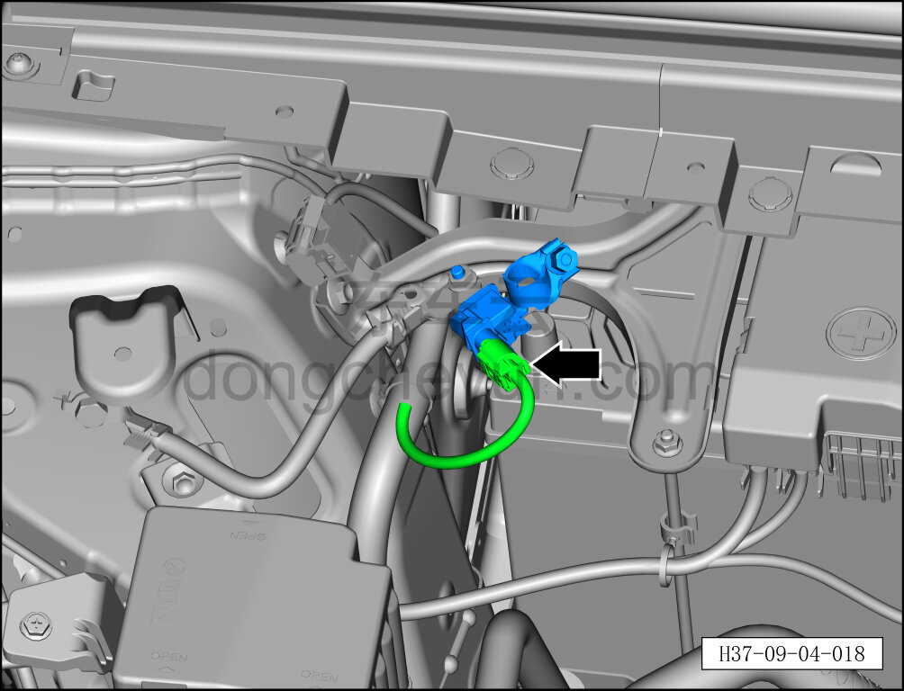
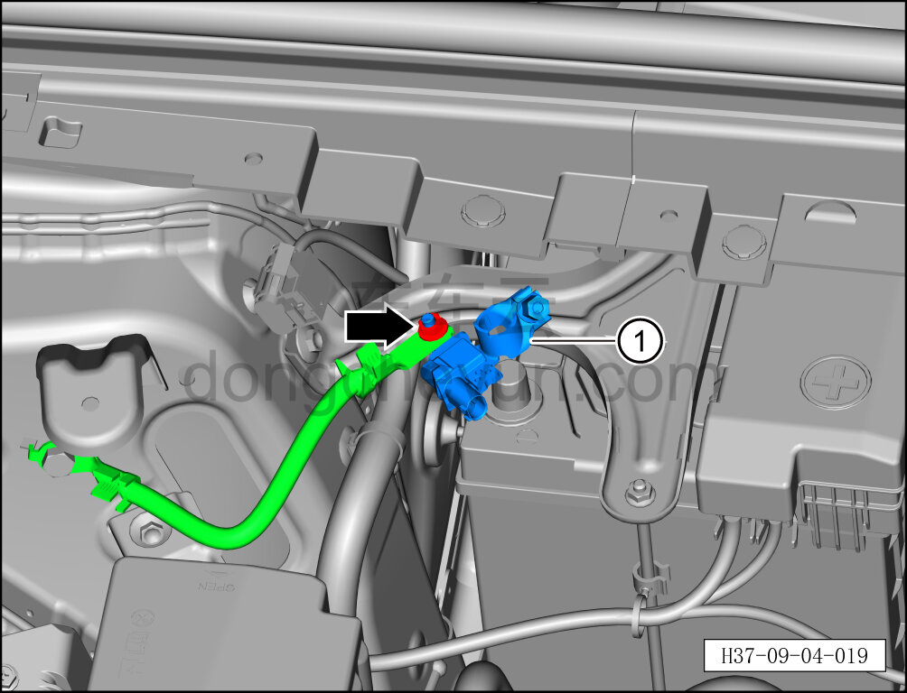

# Снятие и установка датчика аккумуляторной батареи 12 В

> Электрическая и электронная система › Система низковольтного электропитания › Аккумуляторная батарея 12 В и её принадлежности  
> Оригинал: `拆卸与安装蓄电池传感器` · [dongcheyun 56746](https://dongcheyun.com/p/56746), страница `16c849da1c9041f79b574504a8b1bb05` · [оглавление](../README.md)

**Порядок снятия**

1. Выключите все электроприборы, отключите питание.

2. Выполните обесточивание автомобиля для ремонта. См. [3.1.4.1 Обесточивание автомобиля](../03-техническое-обслуживание/005-обесточивание-автомобиля.md)

3. Снимите датчик аккумуляторной батареи 12 В.

a. Откройте защитный колпачок плюсовой клеммы аккумуляторной батареи 12 В в направлении стрелки.

b. С помощью торцевой головки на 10 мм отверните крепёжную гайку датчика аккумуляторной батареи 12 В.

Момент затяжки гайки: 8±1 Н·м

c. Извлеките датчик аккумуляторной батареи 12 В ①.

**Порядок установки**

Установка выполняется в обратном порядке.

**Примечание:**

**- После завершения установки подключите диагностический сканер и проверьте все блоки управления на наличие кодов неисправностей.**
