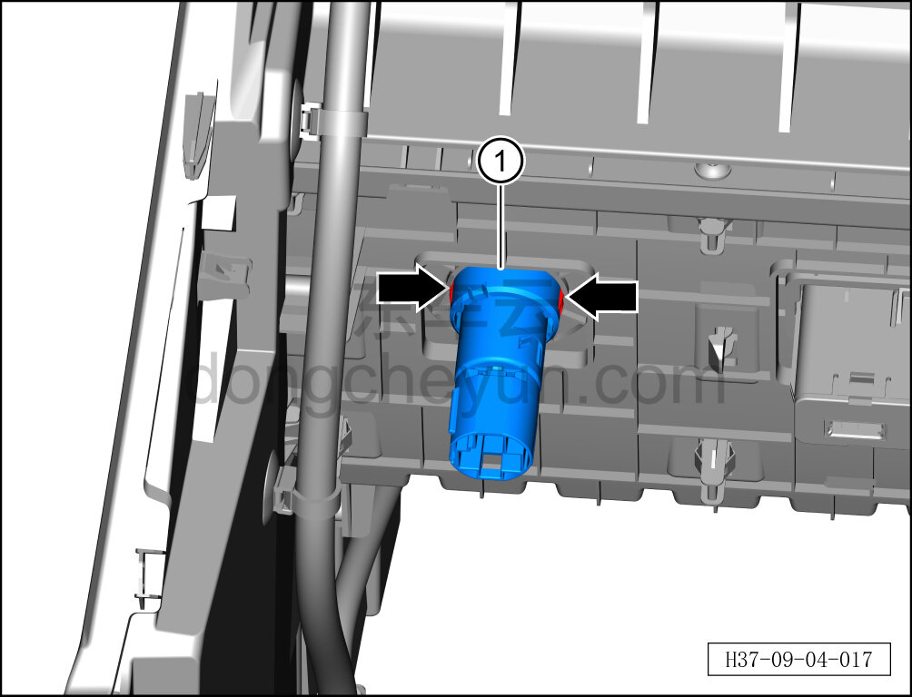

# Снятие и установка розетки питания 12 В

> Электрическая и электронная система › Система низковольтного электропитания › Разъём питания 12 В  
> Оригинал: `拆卸与安装12V 电源插座` · [dongcheyun 56746](https://dongcheyun.com/p/56746), страница `dfc1131d669d434c92276c66623b1e59` · [оглавление](../README.md)

**Порядок снятия**

1. Выключите все электроприборы, отключите питание.

2. Выполните обесточивание автомобиля для ремонта. См. [3.1.4.1 Обесточивание автомобиля](../03-техническое-обслуживание/005-обесточивание-автомобиля.md)

3. Снимите центральную консоль в сборе. См. [8.3.4.8 Снятие и установка центральной консоли в сборе](../08-внутренняя-и-внешняя-отделка/098-снятие-и-установка-центральной-консоли-в-сборе.md)

4. Снимите розетку питания 12 В.

a. Нажав на фиксирующие клипсы с обеих сторон розетки питания 12 В, извлеките розетку питания 12 В ①.

**Порядок установки**

Установка выполняется в обратном порядке.

**Внимание:**

**- При установке розетки питания убедитесь в надёжной фиксации клипс.**

**- После завершения установки проверьте нормальную работу розетки питания 12 В.**
